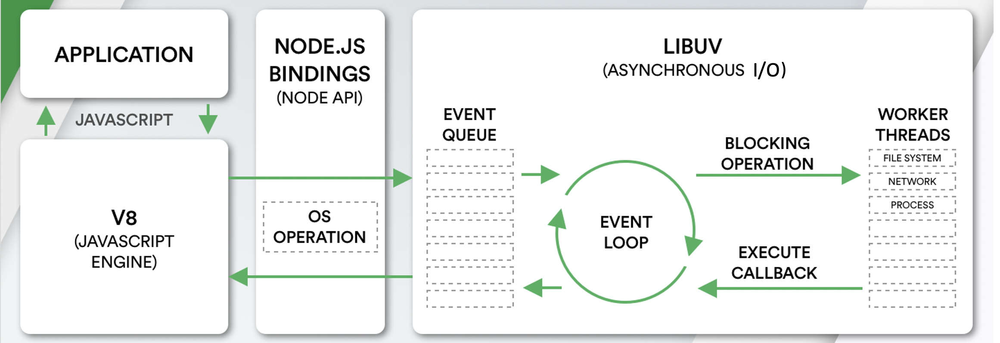
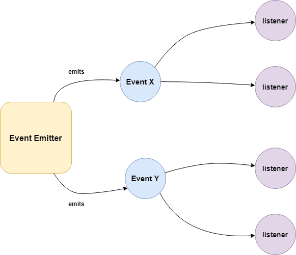
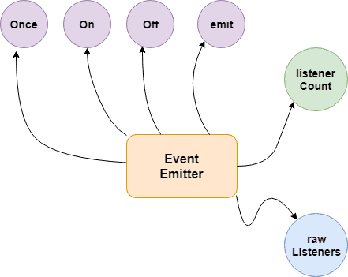
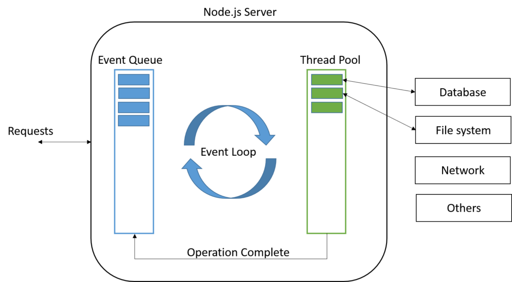

# Node.js Basics

> *Click &#9733; if you like the project. Your contributions are heartily ♡ welcome.*

<br/>

## Related Topics

* *[HTML Basics](https://github.com/learning-zone/html-basics)*
* *[CSS Basics](https://github.com/learning-zone/css-basics)*
* *[JavaScript Basics](https://github.com/learning-zone/javascript-basics)*
* *[SQL Basics](https://github.com/learning-zone/sql-basics)*
* *[MongoDB Basics](https://github.com/learning-zone/mongodb-basics)*
* *[Node.js APIs](nodejs-api.md)*
* *[Node.js Commands](nodejs-commands.md)*
* *[Node.js Coding Practice](nodejs-programming.md)*

<br/>

## Table of Contents

* [Introduction](#-1-introduction)
* [Node.js Setup](#-2-nodejs-setup)
* [Node.js Data Types](#-3-nodejs-data-types)
* [Node.js Architecture](#-4-nodejs-architecture)
* [Node.js Events](#-5-nodejs-events)
* [Node.js File System](#-6-nodejs-file-system)
* [Node.js Streams](#-7-nodejs-streams)
* [Node.js Multithreading](#-8-nodejs-multithreading)
* [Node.js Web Module](#-9-nodejs-web-module)
* [Node.js Middleware](#-10-nodejs-middleware)
* [Node.js RESTFul API](#-11-nodejs-restful-api)
* [Node.js Routing](#-12-nodejs-routing)
* [Node.js Caching](#-13-nodejs-caching)
* [Node.js Error Handling](#-14-nodejs-error-handling)
* [Node.js Logging](#-15-nodejs-logging)
* [Node.js Internationalization](#-16-nodejs-internationalization)
* [Node.js Testing](#-17-nodejs-testing)
* [Node.js Miscellaneous](#-18-nodejs-miscellaneous)

<br/>

## # 1. INTRODUCTION

<br/>

## Q. What is Node.js?

Node.js is an open-source server side runtime environment built on Chrome\'s V8 JavaScript engine. It provides an event driven, non-blocking (asynchronous) I/O and cross-platform runtime environment for building highly scalable server-side applications using JavaScript.

<div align="right">
    <b><a href="#table-of-contents">↥ back to top</a></b>
</div>

## Q. What is Node.js Process Model?

Node.js runs in a single process and the application code runs in a single thread and thereby needs less resources than other platforms.

All the user requests to your web application will be handled by a single thread and all the I/O work or long running job is performed asynchronously for a particular request. So, this single thread doesn\'t have to wait for the request to complete and is free to handle the next request. When asynchronous I/O work completes then it processes the request further and sends the response.

<div align="right">
    <b><a href="#table-of-contents">↥ back to top</a></b>
</div>

## Q. What are the key features of Node.js?

* **Asynchronous and Event driven** – All APIs of Node.js are asynchronous. This feature means that if a Node receives a request for some Input/Output operation, it will execute that operation in the background and continue with the processing of other requests. Thus it will not wait for the response from the previous requests.

* **Fast in Code execution** – Node.js uses the V8 JavaScript Runtime engine, the one which is used by Google Chrome. Node has a wrapper over the JavaScript engine which makes the runtime engine much faster and hence processing of requests within Node.js also become faster.

* **Single Threaded but Highly Scalable** – Node.js uses a single thread model for event looping. The response from these events may or may not reach the server immediately. However, this does not block other operations. Thus making Node.js highly scalable. Traditional servers create limited threads to handle requests while Node.js creates a single thread that provides service to much larger numbers of such requests.

* **Node.js library uses JavaScript** – This is another important aspect of Node.js from the developer\'s point of view. The majority of developers are already well-versed in JavaScript. Hence, development in Node.js becomes easier for a developer who knows JavaScript.

* **There is an Active and vibrant community for the Node.js framework** – The active community always keeps the framework updated with the latest trends in the web development.

* **No Buffering** – Node.js applications never buffer any data. They simply output the data in chunks.

<div align="right">
    <b><a href="#table-of-contents">↥ back to top</a></b>
</div>

## Q. How does Node.js work?

A Node.js application creates a single thread on its invocation. Whenever Node.js receives a request, it first completes its processing before moving on to the next request.

Node.js works asynchronously by using the event loop and callback functions, to handle multiple requests coming in parallel. An Event Loop is a functionality which handles and processes all your external events and just converts them to a callback function. It invokes all the event handlers at a proper time. Thus, lots of work is done on the back-end, while processing a single request, so that the new incoming request doesn\'t have to wait if the processing is not complete.

While processing a request, Node.js attaches a callback function to it and moves it to the back-end. Now, whenever its response is ready, an event is called which triggers the associated callback function to send this response.

<div align="right">
    <b><a href="#table-of-contents">↥ back to top</a></b>
</div>

## Q. What is difference between process and threads in Node.js?

**1. Process:**

Processes are basically the programs that are dispatched from the ready state and are scheduled in the CPU for execution. PCB (Process Control Block) holds the concept of process. A process can create other processes which are known as Child Processes. The process takes more time to terminate and it is isolated means it does not share the memory with any other process.

The process can have the following states new, ready, running, waiting, terminated, and suspended.

**2. Thread:**

Thread is the segment of a process which means a process can have multiple threads and these multiple threads are contained within a process. A thread has three states: Running, Ready, and Blocked.

The thread takes less time to terminate as compared to the process but unlike the process, threads do not isolate.

<div align="right">
    <b><a href="#table-of-contents">↥ back to top</a></b>
</div>

## # 2. NODE.JS SETUP

<br/>

## Q. How to create a simple server in Node.js that returns Hello World?

**Step 01**: Create a project directory

```js
mkdir myapp
cd myapp
```

**Step 02**: Initialize project and link it to npm

```js
npm init
```

This creates a `package.json` file in your myapp folder. The file contains references for all npm packages you have downloaded to your project. The command will prompt you to enter a number of things.
You can enter your way through all of them EXCEPT this one:

```js
entry point: (index.js)
```

Rename this to:

```js
app.js
```

**Step 03**: Install Express in the myapp directory

```js
npm install express --save
```

**Step 04**: app.js

```js
/**
 * Express.js
 */
const express = require('express');
const app = express();

app.get('/', function (req, res) {
  res.send('Hello World!');
});

app.listen(3000, function () {
  console.log('App listening on port 3000!');
});
```

**Step 05**: Run the app

```bah
node app.js
```

**&#9885; [Try this example on CodeSandbox](https://codesandbox.io/s/hello-world-in-nodejs-ue3cs3)**

<div align="right">
    <b><a href="#table-of-contents">↥ back to top</a></b>
</div>

## Q. Explain the concept of URL module in Node.js?

The URL module in Node.js splits up a web address into readable parts. Use `require()` to include the module. Then parse an address with the `url.parse()` method, and it will return a URL object with each part of the address as properties.

**Example:**

```js
/**
 * URL Module in Node.js
 */
const url = require('url');
const adr = 'http://localhost:8080/default.htm?year=2022&month=september';
const q = url.parse(adr, true);

console.log(q.host); // localhost:8080
console.log(q.pathname); // "/default.htm"
console.log(q.search); // "?year=2022&month=september"

const qdata = q.query; // { year: 2022, month: 'september' }
console.log(qdata.month); // "september"
```

<div align="right">
    <b><a href="#table-of-contents">↥ back to top</a></b>
</div>

## # 3. NODE.JS DATA TYPES

<br/>

## Q. What are the data types in Node.js?

Just like JS, there are two categories of data types in Node: Primitives and Objects.

**1. Primitives:**

* String
* Number
* BigInt
* Boolean
* Undefined
* Null
* Symbol

**2. Objects:**

* Function
* Array
* Buffer

<div align="right">
    <b><a href="#table-of-contents">↥ back to top</a></b>
</div>

## Q. Explain String data type in Node.js?

Strings in Node.js are sequences of unicode characters. Strings can be wrapped in a single or double quotation marks.
Javascript provide many functions to operate on string, like indexOf(), split(), substr(), length.

**String functions:**

|Function   | Description               |
|-----------|---------------------------|
|charAt()   |It is useful to find a specific character present in a string.|
|concat()   |It is useful to concat more than one string.|
|indexOf()  |It is useful to get the index of a specified character or a part of the string.|
|match()    |It is useful to match multiple strings.|
|split()    |It is useful to split the string and return an array of string.|
|join()     |It is useful to join the array of strings and those are separated by comma (,) operator.|

**Example:**

```js
/** 
 * String Data Type
 */
const str1 = "Hello";
const str2 = 'World';

console.log("Concat Using (+) :" , (str1 + ' ' + str2));
console.log("Concat Using Function :" , (str1.concat(str2)));
```

<div align="right">
    <b><a href="#table-of-contents">↥ back to top</a></b>
</div>

## Q. Explain Number data type in Node.js?

The number data type in Node.js is 64 bits floating point number both positive and negative. The parseInt() and parseFloat() functions are used to convert to number, if it fails to convert into a number then it returns `NaN`.

**Example:**

```js
/**
 * Number Data Type
 */
// Example 01:
const num1 = 10;
const num2 = 20;

console.log(`sum: ${num1 + num2}`); 

// Example 02:
console.log(parseInt("32"));  // 32
console.log(parseFloat("8.24")); // 8.24
console.log(parseInt("234.12345")); // 234
console.log(parseFloat("10")); // 10

// Example 03:
console.log(isFinite(10/5)); // true
console.log(isFinite(10/0)); // false

// Example 04:
console.log(5 / 0); // Infinity
console.log(-5 / 0); // -Infinity
```

<div align="right">
    <b><a href="#table-of-contents">↥ back to top</a></b>
</div>

## Q. Explain BigInt data type in Node.js?

A BigInt value, also sometimes just called a BigInt, is a bigint primitive, created by appending **n** to the end of an integer literal, or by calling the BigInt() function ( without the new operator ) and giving it an integer value or string value.

**Example:**

```js
/**
 * BigInt Data Type
 */
const maxSafeInteger = 99n; // This is a BigInt
const num2 = BigInt('99'); // This is equivalent
const num3 = BigInt(99); // Also works

typeof 1n === 'bigint'           // true
typeof BigInt('1') === 'bigint'  // true
```

<div align="right">
    <b><a href="#table-of-contents">↥ back to top</a></b>
</div>

## Q. Explain Boolean data type in Node.js?

Boolean data type is a data type that has one of two possible values, either true or false. In programming, it is used in logical representation or to control program structure.

The boolean() function is used to convert any data type to a boolean value. According to the rules, false, 0, NaN, null, undefined, empty string evaluate to false and other values evaluates to true.

**Example:**

```js
/**
 * Boolean Data Type
 */
// Example 01:
const isValid = true; 
console.log(isValid); // true 

// Example 02:
console.log(true && true); // true 
console.log(true && false); // false 
console.log(true || false); // true 
console.log(false || false); // false 
console.log(!true); // false 
console.log(!false); // true 
```

<div align="right">
    <b><a href="#table-of-contents">↥ back to top</a></b>
</div>

## Q. Explain `Undefined` and `Null` data type in Node.js?

In node.js, if a variable is defined without assigning any value, then that will take **undefined** as value. If we assign a null value to the variable, then the value of the variable becomes **null**.

**Example:**

```js
/**
 * NULL and UNDEFINED Data Type
 */
let x;
console.log(x); // undefined

let y = null;
console.log(y); // null
```

<div align="right">
    <b><a href="#table-of-contents">↥ back to top</a></b>
</div>

## Q. Explain Symbol data type in Node.js?

Symbol is an immutable primitive value that is unique. It\'s a very peculiar data type. Once you create a symbol, its value is kept private and for internal use.

**Example:**

```js
/**
 * Symbol Data Type
 */
const NAME = Symbol()
const person = {
  [NAME]: 'Ritika Bhavsar'
}

person[NAME] // 'Ritika Bhavsar'
```

<div align="right">
    <b><a href="#table-of-contents">↥ back to top</a></b>
</div>

## Q. Explain function in Node.js?

Functions are first class citizens in Node\'s JavaScript, similar to the browser\'s JavaScript. A function can have attributes and properties also. It can be treated like a class in JavaScript.

**Example:**

```js
/**
 * Function in Node.js
 */
function Messsage(name) {
 console.log("Hello "+name);
}

Messsage("World"); // Hello World
```

<div align="right">
    <b><a href="#table-of-contents">↥ back to top</a></b>
</div>

## Q. Explain Buffer data type in Node.js?

Node.js includes an additional data type called Buffer ( not available in browser\'s JavaScript ). Buffer is mainly used to store **binary data**, while reading from a file or receiving packets over the network.

**Example:**

```js
/**
 * Buffer Data Type
 */
let b = new Buffer(10000);
let str = "----------";

b.write(str); 
console.log( str.length ); // 10
console.log( b.length ); // 10000
```

*Note: Buffer() is deprecated due to security and usability issues.*

<div align="right">
    <b><a href="#table-of-contents">↥ back to top</a></b>
</div>

## # 4. NODE.JS ARCHITECTURE

<br/>

## Q. How does Node.js works?

Node.js is completely event-driven. Basically the server consists of one thread processing one event after another.

A new request coming in is one kind of event. The server starts processing it and when there is a blocking IO operation, it does not wait until it completes and instead registers a callback function. The server then immediately starts to process another event ( maybe another request ). When the IO operation is finished, that is another kind of event, and the server will process it ( i.e. continue working on the request ) by executing the callback as soon as it has time.

Node.js Platform does not follow Request/Response Multi-Threaded Stateless Model. It follows Single Threaded with Event Loop Model. Node.js Processing model mainly based on Javascript Event based model with Javascript callback mechanism.  

<p align="center">
  
</p>
  
**Single Threaded Event Loop Model Processing Steps:**

* Clients Send request to Web Server.
* Node.js Web Server internally maintains a Limited Thread pool to provide services to the Client Requests.
* Node.js Web Server receives those requests and places them into a Queue. It is known as **Event Queue**.
* Node.js Web Server internally has a Component, known as **Event Loop**. Why it got this name is that it uses indefinite loop to receive requests and process them.
* Event Loop uses Single Thread only. It is main heart of Node.js Platform Processing Model.
* Event Loop checks any Client Request is placed in Event Queue. If no, then wait for incoming requests for indefinitely.
* If yes, then pick up one Client Request from Event Queue
    * Starts process that Client Request
    * If that Client Request Does Not requires any Blocking IO Operations, then process everything, prepare response and send it back to client.
    * If that Client Request requires some Blocking IO Operations like interacting with Database, File System, External Services then it will follow different approach
        * Checks Threads availability from Internal Thread Pool
        * Picks up one Thread and assign this Client Request to that thread.
        * That Thread is responsible for taking that request, process it, perform Blocking IO operations, prepare response and send it back to the Event Loop
        * Event Loop in turn, sends that Response to the respective Client.

<div align="right">
    <b><a href="#table-of-contents">↥ back to top</a></b>
</div>

## Q. What are the core modules of Node.js?

Node.js has a set of core modules that are part of the platform and come with the Node.js installation. These modules can be loaded into the program by using the require function.

**Syntax:**

```js
const module = require('module_name');
```

**Example:**

```js
const http = require('http');

http.createServer(function (req, res) {
  res.writeHead(200, {'Content-Type': 'text/html'});
  res.write('Welcome to Node.js!');
  res.end();
}).listen(3000);
```

The following table lists some of the important core modules in Node.js.

|Name         |Description                                             |
|-------------|--------------------------------------------------------|
|Assert       |It is used by Node.js for testing itself. It can be accessed with require('assert').|
|Buffer       |It is used to perform operations on raw bytes of data which reside in memory. It can be accessed with require('buffer')|
|Child Process|It is used by node.js for managing child processes. It can be accessed with require('child_process').|
|Cluster      |This module is used by Node.js to take advantage of multi-core systems, so that it can handle more load. It can be accessed with require('cluster').|
|Console      |It is used to write data to console. Node.js has a Console object which contains functions to write data to console. It can be accessed with require('console'). |
|Crypto       |It is used to support cryptography for encryption and decryption. It can be accessed with require('crypto').|
|HTTP         |It includes classes, methods and events to create Node.js http server.|
|URL          |It includes methods for URL resolution and parsing.|
|Query String |It includes methods to deal with query string.|
|Path         |It includes methods to deal with file paths.|
|File System  |It includes classes, methods, and events to work with file I/O.|
|Util         |It includes utility functions useful for programmers.|
|Zlib         |It is used to compress and decompress data. It can be accessed with require('zlib').|

<div align="right">
    <b><a href="#table-of-contents">↥ back to top</a></b>
</div>

## Q. What do you understand by Reactor Pattern in Node.js?

**Reactor Pattern** is used to avoid the blocking of the Input/Output operations. It provides us with a handler that is associated with I/O operations. When the I/O requests are to be generated, they get submitted to a demultiplexer, which handles concurrency in avoiding the blocking of the I/O mode and collects the requests in form of an event and queues those events.

**There are two ways in which I/O operations are performed:**

**1. Blocking I/O:** Application will make a function call and pause its execution at a point until the data is received. It is called as "Synchronous".

**2. Non-Blocking I/O:** Application will make a function call, and, without waiting for the results it continues its execution. It is called as "Asynchronous".

<p align="center">
  
</p>

**Reactor Pattern comprises of:**

**1. Resources:** They are shared by multiple applications for I/O operations, generally slower in executions.

**2. Synchronous Event De-multiplexer/Event Notifier:** This uses Event Loop for blocking on all resources. When a set of I/O operations completes, the Event De-multiplexer pushes the new events into the Event Queue.

**3. Event Loop and Event Queue:** Event Queue queues up the new events that occurred along with its event-handler, pair.

**4. Request Handler/Application:** This is, generally, the application that provides the handler to be executed for registered events on resources.

<div align="right">
    <b><a href="#table-of-contents">↥ back to top</a></b>
</div>

## Q. What are the global objects of Node.js?

Node.js Global Objects are the objects that are available in all modules. Global Objects are built-in objects that are part of the JavaScript and can be used directly in the application without importing any particular module.

These objects are modules, functions, strings and object itself as explained below.

**1. global:**

It is a global namespace. Defining a variable within this namespace makes it globally accessible.

```js
var myvar;
```

**2. process:**

It is an inbuilt global object that is an instance of EventEmitter used to get information on current process. It can also be accessed using require() explicitly.

**3. console:**

It is an inbuilt global object used to print to stdout and stderr.

```js
console.log("Hello World"); // Hello World
```

**4. setTimeout(), clearTimeout(), setInterval(), clearInterval():**

The built-in timer functions are globals

```js
function printHello() {
   console.log( "Hello, World!");
}

// Now call above function after 2 seconds
var timeoutObj = setTimeout(printHello, 2000);
```

**5. __dirname:**

It is a string. It specifies the name of the directory that currently contains the code.

```js
console.log(__dirname);
```

**6. __filename:**

It specifies the filename of the code being executed. This is the resolved absolute path of this code file. The value inside a module is the path to that module file.

```js
console.log(__filename);
```

<div align="right">
    <b><a href="#table-of-contents">↥ back to top</a></b>
</div>

## Q. What is chrome v8 engine?

V8 is a C++ based open-source JavaScript engine developed by Google. It was originally designed for Google Chrome and Chromium-based browsers ( such as Brave ) in 2008, but it was later utilized to create Node.js for server-side coding.

V8 is the JavaScript engine i.e. it parses and executes JavaScript code. The DOM, and the other Web Platform APIs ( they all makeup runtime environment ) are provided by the browser.

V8 is known to be a JavaScript engine because it takes JavaScript code and executes it while browsing in Chrome. It provides a runtime environment for the execution of JavaScript code. The best part is that the JavaScript engine is completely independent of the browser in which it runs.

<div align="right">
    <b><a href="#table-of-contents">↥ back to top</a></b>
</div>

## Q. Why is LIBUV needed in Node JS?

**libuv** is a C library originally written for Node.js to abstract non-blocking I/O operations. It provides the following features:

* It allows the CPU and other resources to be used simultaneously while still performing I/O operations, thereby resulting in efficient use of resources and network.
* It facilitates an event-driven approach wherein I/O and other activities are performed using callback-based notifications.
* It provides mechanisms to handle file system, DNS, network, child processes, pipes, signal handling, polling and streaming
* It also includes a thread pool for offloading work for some things that can\'t be done asynchronously at the operating system level.

<div align="right">
    <b><a href="#table-of-contents">↥ back to top</a></b>
</div>

## Q. How V8 compiles JavaScript code?

Compilation is the process of converting human-readable code to machine code. There are two ways to compile the code

* **Using an Interpreter**: The interpreter scans the code line by line and converts it into byte code.
* **Using a Compiler**: The Compiler scans the entire document and compiles it into highly optimized byte code.

The V8 engine uses both a compiler and an interpreter and follows **just-in-time (JIT)** compilation to speed up the execution. JIT compiling works by compiling small portions of code that are just about to be executed. This prevents long compilation time and the code being compiles is only that which is highly likely to run.

<div align="right">
    <b><a href="#table-of-contents">↥ back to top</a></b>
</div>

## # 5. NODE.JS EVENTS

<br/>

## Q. What is EventEmitter in Node.js?

The EventEmitter is a class that facilitates communication/interaction between objects in Node.js. The EventEmitter class can be used to create and handle custom events.

EventEmitter is at the core of Node asynchronous event-driven architecture. Many of Node\'s built-in modules inherit from EventEmitter including prominent frameworks like Express.js. An emitter object basically has two main features:

* Emitting name events.
* Registering and unregistering listener functions.

**Example:**

```js
/**
 * Callback Events with Parameters
 */
const events = require('events');
const eventEmitter = new events.EventEmitter();

function listener(code, msg) {
   console.log(`status ${code} and ${msg}`);
}

eventEmitter.on('status', listener); // Register listener
eventEmitter.emit('status', 200, 'ok');

// Output
status 200 and ok
```

<div align="right">
    <b><a href="#table-of-contents">↥ back to top</a></b>
</div>

## Q. How does the EventEmitter works in Node.js?

* Event Emitter emits the data in an event called message
* A Listened is registered on the event message
* when the message event emits some data, the listener will get the data

<p align="center">
  
</p>

**Building Blocks:**

* **.emit()** - this method in event emitter is to emit an event in module
* **.on()** - this method is to listen to data on a registered event in node.js
* **.once()** - it listen to data on a registered event only once.
* **.addListener()** - it checks if the listener is registered for an event.
* **.removeListener()** - it removes the listener for an event.

<p align="center">
  
</p>

**Example 01:**

```js
/**
 * Callbacks Events
 */
const events = require('events');
const eventEmitter = new events.EventEmitter();

function listenerOne() {
   console.log('First Listener Executed');
}

function listenerTwo() {
   console.log('Second Listener Executed');
}

eventEmitter.on('listenerOne', listenerOne); // Register for listenerOne
eventEmitter.on('listenerOne', listenerTwo); // Register for listenerOne

// When the event "listenerOne" is emitted, both the above callbacks should be invoked.
eventEmitter.emit('listenerOne');

// Output
First Listener Executed
Second Listener Executed
```

**Example 02:**

```js
/**
 * Emit Events Once
 */
const events = require('events');
const eventEmitter = new events.EventEmitter();

function listenerOnce() {
   console.log('listenerOnce fired once');
}

eventEmitter.once('listenerOne', listenerOnce); // Register listenerOnce
eventEmitter.emit('listenerOne');

// Output
listenerOnce fired once
```

<div align="right">
    <b><a href="#table-of-contents">↥ back to top</a></b>
</div>

## Q. What are the EventEmitter methods available in Node.js?

|EventEmitter Methods | Description         |
|---------------------|---------------------|
|.addListener(event, listener) |Adds a listener to the end of the listeners array for the specified event.|
|.on(event, listener) |Adds a listener to the end of the listeners array for the specified event. It can also be called as an alias of emitter.addListener()|
|.once(event, listener)|This listener is invoked only the next time the event is fired, after which it is removed.|
|.removeListener(event, listener)|Removes a listener from the listener array for the specified event.|
|.removeAllListeners([event])|Removes all listeners, or those of the specified event.|
|.setMaxListeners(n)  |By default EventEmitters will print a warning if more than 10 listeners are added for a particular event.|
|.getMaxListeners()   |Returns the current maximum listener value for the emitter which is either set by emitter.setMaxListeners(n) or defaults to EventEmitter.defaultMaxListeners.|
|.listeners(event)    |Returns a copy of the array of listeners for the specified event.|
|.emit(event[, arg1][, arg2][, ...]) |Raise the specified events with the supplied arguments.|
|.listenerCount(type) |Returns the number of listeners listening to the type of event.|

<div align="right">
    <b><a href="#table-of-contents">↥ back to top</a></b>
</div>

## Q. How the Event Loop Works in Node.js?

The **event loop** allows Node.js to perform non-blocking I/O operations despite the fact that JavaScript is single-threaded. It is done by offloading operations to the system kernel whenever possible.

Node.js is a single-threaded application, but it can support **concurrency** via the concept of **event** and **callbacks**. Every API of Node.js is asynchronous and being single-threaded, they use **async function calls** to maintain concurrency. Node uses observer pattern. Node thread keeps an event loop and whenever a task gets completed, it fires the corresponding event which signals the event-listener function to execute.

**Features of Event Loop:**

* Event loop is an endless loop, which waits for tasks, executes them and then sleeps until it receives more tasks.
* The event loop executes tasks from the event queue only when the call stack is empty i.e. there is no ongoing task.
* The event loop allows us to use callbacks and promises.
* The event loop executes the tasks starting from the oldest first.

<p align="center">
  
</p>

**Example:**

```js
/**
 * Event loop in Node.js
 */
const events = require('events');
const eventEmitter = new events.EventEmitter();

// Create an event handler as follows
const connectHandler = function connected() {
   console.log('connection succesful.');
   eventEmitter.emit('data_received');
}

// Bind the connection event with the handler
eventEmitter.on('connection', connectHandler);
 
// Bind the data_received event with the anonymous function
eventEmitter.on('data_received', function() {
   console.log('data received succesfully.');
});

// Fire the connection event 
eventEmitter.emit('connection');
console.log("Program Ended.");

// Output
Connection succesful.
Data received succesfully.
Program Ended.
```

<div align="right">
    <b><a href="#table-of-contents">↥ back to top</a></b>
</div>

## Q. How are event listeners created in Node.JS?

An array containing all eventListeners is maintained by Node. Each time **.on()** function is executed, a new event listener is added to that array. When the concerned event is emitted, each **eventListener** that is present in the array is called in a sequential or synchronous manner.

The event listeners are called in a synchronous manner to avoid logical errors, race conditions etc. The total number of listeners that can be registered for a particular event, is controlled by **.setMaxListeners(n)**. The default number of listeners is 10.

```js
emitter.setMaxlisteners(12);
```

As an event Listener once registered, exists throughout the life cycle of the program. It is important to detach an event Listener once its no longer needed to avoid memory leaks. Functions like **.removeListener()**, **.removeAllListeners()** enable the removal of listeners from the listeners Array.

<div align="right">
    <b><a href="#table-of-contents">↥ back to top</a></b>
</div>

## Q. What is the difference between process.nextTick() and setImmediate()?

**1. process.nextTick():**

The process.nextTick() method adds the callback function to the start of the next event queue. It is to be noted that, at the start of the program process.nextTick() method is called for the first time before the event loop is processed.

**2. setImmediate():**

The setImmediate() method is used to execute a function right after the current event loop finishes. It is callback function is placed in the check phase of the next event queue.

**Example:**

```js
/**
 * setImmediate() and process.nextTick()
 */
setImmediate(() => {
  console.log("1st Immediate");
});

setImmediate(() => {
  console.log("2nd Immediate");
});

process.nextTick(() => {
  console.log("1st Process");
});

process.nextTick(() => {
  console.log("2nd Process");
});

// First event queue ends here
console.log("Program Started");

// Output
Program Started
1st Process
2nd Process
1st Immediate
2nd Immediate
```

<div align="right">
    <b><a href="#table-of-contents">↥ back to top</a></b>
</div>

## Q. What is callback function in Node.js?

A callback is a function which is called when a task is completed, thus helps in preventing any kind of blocking and a callback function allows other code to run in the meantime.

Callback is called when task get completed and is asynchronous equivalent for a function. Using Callback concept, Node.js can process a large number of requests without waiting for any function to return the result which makes Node.js highly scalable.

**Example:**

```js
/**
 * Callback Function
 */
function message(name, callback) {
  console.log("Hi" + " " + name);
  callback();
}

// Callback function
function callMe() {
  console.log("I am callback function");
}

// Passing function as an argument
message("Node.JS", callMe);
```

**Output:**

```js
Hi Node.JS
I am callback function
```

<div align="right">
    <b><a href="#table-of-contents">↥ back to top</a></b>
</div>

## Q. What are the difference between Events and Callbacks?

**1. Events:**

Node.js **events** module which emits named events that can cause corresponding functions or callbacks to be called. Functions ( callbacks ) listen or subscribe to a particular event to occur and when that event triggers, all the callbacks subscribed to that event are fired one by one in order to which they were registered.

All objects that emit events are instances of the **EventEmitter** class. The event can be emitted or listen to an event with the help of EventEmitter

**Example:**

```js
/**
 * Events Module
 */
const event = require('events');  
const eventEmitter = new event.EventEmitter();  
  
// add listener function for Sum event  
eventEmitter.on('Sum', function(num1, num2) {  
    console.log('Total: ' + (num1 + num2));  
});  

// call event  
eventEmitter.emit('Sum', 10, 20);

// Output
Total: 30
```

**2. Callbacks:**

A callback function is a function passed into another function as an argument, which is then invoked inside the outer function to complete some kind of routine or action.

**Example:**

```js
/**
 * Callbacks
 */
function sum(number) {
  console.log('Total: ' + number);
}

function calculator(num1, num2, callback) {
  let total = num1 + num2;
  callback(total);
}

calculator(10, 20, sum);

// Output
Total: 30
```

Callback functions are called when an asynchronous function returns its result, whereas event handling works on the **observer pattern**. The functions that listen to events act as Observers. Whenever an event gets fired, its listener function starts executing. Node.js has multiple in-built events available through events module and EventEmitter class which are used to bind events and event-listeners

<div align="right">
    <b><a href="#table-of-contents">↥ back to top</a></b>
</div>

## Q. What is an error-first callback?

The pattern used across all the asynchronous methods in Node.js is called *Error-first Callback*. Here is an example:

```js
fs.readFile( "file.json", function ( err, data ) {
  if ( err ) {
    console.error( err );
  }
  console.log( data );
});
```

Any asynchronous method expects one of the arguments to be a callback. The full callback argument list depends on the caller method, but the first argument is always an error object or null. When we go for the asynchronous method, an exception thrown during function execution cannot be detected in a try/catch statement. The event happens after the JavaScript engine leaves the try block.

In the preceding example, if any exception is thrown during the reading of the file, it lands on the callback function as the first and mandatory parameter.

<div align="right">
    <b><a href="#table-of-contents">↥ back to top</a></b>
</div>

## Q. What is callback hell in Node.js?

The callback hell contains complex nested callbacks. Here, every callback takes an argument that is a result of the previous callbacks. In this way, the code structure looks like a pyramid, making it difficult to read and maintain. Also, if there is an error in one function, then all other functions get affected.

An asynchronous function is one where some external activity must complete before a result can be processed; it is "asynchronous" in the sense that there is an unpredictable amount of time before a result becomes available. Such functions require a callback function to handle errors and process the result.

**Example:**

```js
/**
 * Callback Hell
 */
firstFunction(function (a) {
  secondFunction(a, function (b) {
    thirdFunction(b, function (c) {
      // And so on…
    });
  });
});
```

<div align="right">
    <b><a href="#table-of-contents">↥ back to top</a></b>
</div>

## Q. How to avoid callback hell in Node.js?

**1. Managing callbacks using Async.js:**  

`Async` is a really powerful npm module for managing asynchronous nature of JavaScript. Along with Node.js, it also works for JavaScript written for browsers.

Async provides lots of powerful utilities to work with asynchronous processes under different scenarios.

```js
npm install --save async
```

**2. Managing callbacks hell using promises:**  

Promises are alternative to callbacks while dealing with asynchronous code. Promises return the value of the result or an error exception. The core of the promises is the `.then()` function, which waits for the promise object to be returned.

The `.then()` function takes two optional functions as arguments and depending on the state of the promise only one will ever be called. The first function is called when the promise if fulfilled (A successful result). The second function is called when the promise is rejected.

**Example:**

```js
/**
 * Promises
 */
const myPromise = new Promise((resolve, reject) => {
  setTimeout(() => {
    resolve("Successful!");
  }, 300);
});
```

**3. Using Async Await:**  

Async await makes asynchronous code look like it\'s synchronous. This has only been possible because of the reintroduction of promises into node.js. Async-Await only works with functions that return a promise.

**Example:**

```js
/**
 * Async Await
 */
const getrandomnumber = function(){
    return new Promise((resolve, reject)=>{
        setTimeout(() => {
            resolve(Math.floor(Math.random() * 20));
        }, 1000);
    });
}

const addRandomNumber = async function(){
    const sum = await getrandomnumber() + await getrandomnumber();
    console.log(sum);
}

addRandomNumber();
```

<div align="right">
    <b><a href="#table-of-contents">↥ back to top</a></b>
</div>

## Q. What is typically the first argument passed to a callback handler?

The first parameter of the callback is the **error** value. If the function hits an error, then they typically call the **callback** with the first parameter being an Error object.

**Example:**

```js
/**
 * Callback Handler
 */
const Division = (numerator, denominator, callback) => {
    if (denominator === 0) {
      callback(new Error('Divide by zero error!'));
    } else {
      callback(null, numerator / denominator);
    }
};

// Function Call
Division(5, 0, (err, result) => {
  if (err) {
    return console.log(err.message);
  }
  console.log(`Result: ${result}`);
});
```

<div align="right">
    <b><a href="#table-of-contents">↥ back to top</a></b>
</div>

## Q. What are the timing features of Node.js?

The Timers module in Node.js contains functions that execute code after a set period of time. Timers do not need to be imported via require(), since all the methods are available globally to emulate the browser JavaScript API.

Some of the functions provided in this module are

**1. setTimeout():**

This function schedules code execution after the assigned amount of time ( in milliseconds ). Only after the timeout has occurred, the code will be executed. This method returns an ID that can be used in **clearTimeout()** method.

**Syntax:**

```js
setTimeout(callback, delay, args )
```

**Example:**

```js
function printMessage(arg) {
  console.log(`${arg}`);
}

setTimeout(printMessage, 1000, 'Display this Message after 1 seconds!');
```

**2. setImmediate():**

The setImmediate() method executes the code at the end of the current event loop cycle. The function passed in the setImmediate() argument is a function that will be executed in the next iteration of the event loop.

**Syntax:**

```js
setImmediate(callback, args)
```

**Example:**

```js
// Setting timeout for the function
setTimeout(function () {
    console.log('setTimeout() function running...');
}, 500);

// Running this function immediately before any other
setImmediate(function () {
   console.log('setImmediate() function running...');
});

// Directly printing the statement
console.log('Normal statement in the event loop');

// Output
// Normal statement in the event loop
// setImmediate() function running...
// setTimeout() function running...
```

**3. setInterval():**

The setInterval() method executes the code after the specified interval. The function is executed multiple times after the interval has passed. The function will keep on calling until the process is stopped externally or using code after specified time period. The clearInterval() method can be used to prevent the function from running.

**Syntax:**

```js
setInterval(callback, delay, args)
```

**Example:**

```js
setInterval(function() {
    console.log('Display this Message intervals of 1 seconds!');
}, 1000);
```

<div align="right">
    <b><a href="#table-of-contents">↥ back to top</a></b>
</div>

## Q. How to implement a sleep function in Node.js?

One way to delay execution of a function in Node.js is to use async/await with promises to delay execution without callbacks function. Just put the code you want to delay in the callback. For example, below is how you can wait 1 second before executing some code.

**Example:**

```js
function delay(time) {
  return new Promise((resolve) => setTimeout(resolve, time));
}

async function run() {
  await delay(1000);
  console.log("This printed after about 1 second");
}

run();
```

<div align="right">
    <b><a href="#table-of-contents">↥ back to top</a></b>
</div>

## # 6. NODE.JS FILE SYSTEM

<br/>

## Q. How Node.js read the content of a file?

The "normal" way in Node.js is probably to read in the content of a file in a non-blocking, asynchronous way. That is, to tell Node to read in the file, and then to get a callback when the file-reading has been finished. That would allow us to handle several requests in parallel.

Common use for the File System module:

* Read files
* Create files
* Update files
* Delete files
* Rename files  

**Example:** Read Files

```html
<!-- index.html -->
<html>
<body>
  <h1>File Header</h1>
  <p>File Paragraph.</p>
</body>
</html>
```

```js
/**
 * read_file.js
 */
const http = require('http');
const fs = require('fs');

http.createServer(function (req, res) {
  fs.readFile('index.html', function(err, data) {
    res.writeHead(200, {'Content-Type': 'text/html'});
    res.write(data);
    res.end();
  });
}).listen(3000);
```

<div align="right">
    <b><a href="#table-of-contents">↥ back to top</a></b>
</div>

## # 7. NODE.JS STREAMS

<br/>

## Q. How many types of streams are present in node.js?

Streams are objects that let you read data from a source or write data to a destination in continuous fashion.
There are four types of streams

* **Readable** − Stream which is used for read operation.
* **Writable** − Stream which is used for write operation.
* **Duplex** − Stream which can be used for both read and write operation.
* **Transform** − A type of duplex stream where the output is computed based on input.  

Each type of Stream is an EventEmitter instance and throws several events at different instance of times.  

**Methods:**

* **data** − This event is fired when there is data is available to read.
* **end** − This event is fired when there is no more data to read.
* **error** − This event is fired when there is any error receiving or writing data.
* **finish** − This event is fired when all the data has been flushed to underlying system.

**1. Reading from a Stream:**

```js
const fs = require("fs");
let data = "";

// Create a readable stream
const readerStream = fs.createReadStream("file.txt");

// Set the encoding to be utf8.
readerStream.setEncoding("UTF8");

// Handle stream events --> data, end, and error
readerStream.on("data", function (chunk) {
  data += chunk;
});

readerStream.on("end", function () {
  console.log(data);
});

readerStream.on("error", function (err) {
  console.log(err.stack);
});
```

**2. Writing to a Stream:**

```js
const fs = require("fs");
const data = "File writing to a stream example";

// Create a writable stream
const writerStream = fs.createWriteStream("file.txt");

// Write the data to stream with encoding to be utf8
writerStream.write(data, "UTF8");

// Mark the end of file
writerStream.end();

// Handle stream events --> finish, and error
writerStream.on("finish", function () {
  console.log("Write completed.");
});

writerStream.on("error", function (err) {
  console.log(err.stack);
});
```