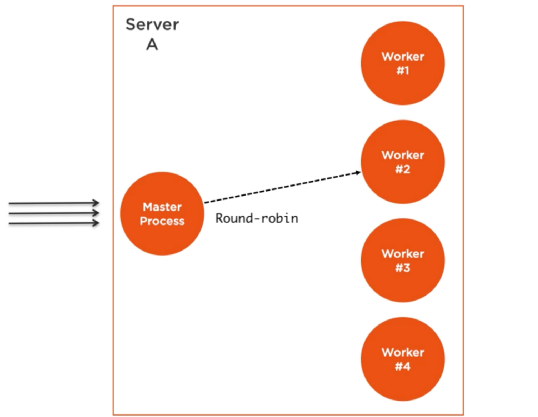
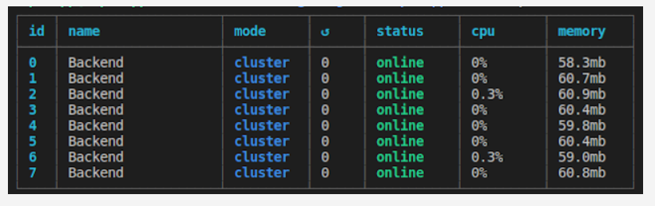
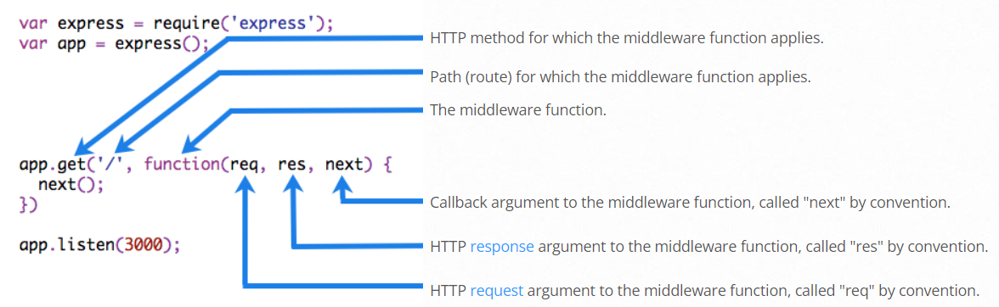

# Node.js Basics

> *Click &#9733; if you like the project. Your contributions are heartily ♡ welcome.*

<br/>

## Related Topics

* *[SQL Basics](https://github.com/rahull0328/sql-basics)*
* *[MongoDB Basics](https://github.com/rahull0328/mongodb-basics)*
* *[Node.js APIs](nodejs-api.md)*
* *[Node.js Commands](nodejs-commands.md)*
* *[Node.js Coding Practice](nodejs-programming.md)*

<br/>

## Table of Contents

* [Introduction](#-1-introduction)
* [Node.js Setup](#-2-nodejs-setup)
* [Node.js Data Types](#-3-nodejs-data-types)
* [Node.js Architecture](#-4-nodejs-architecture)
* [Node.js Events](#-5-nodejs-events)
* [Node.js File System](#-6-nodejs-file-system)
* [Node.js Streams](#-7-nodejs-streams)
* [Node.js Multithreading](#-8-nodejs-multithreading)
* [Node.js Web Module](#-9-nodejs-web-module)
* [Node.js Middleware](#-10-nodejs-middleware)
* [Node.js RESTFul API](#-11-nodejs-restful-api)
* [Node.js Routing](#-12-nodejs-routing)
* [Node.js Caching](#-13-nodejs-caching)
* [Node.js Error Handling](#-14-nodejs-error-handling)
* [Node.js Logging](#-15-nodejs-logging)
* [Node.js Internationalization](#-16-nodejs-internationalization)
* [Node.js Testing](#-17-nodejs-testing)
* [Node.js Miscellaneous](#-18-nodejs-miscellaneous)

<br/>

## # 1. INTRODUCTION

<br/>

## Q. What is Node.js?

Node.js is an open-source server side runtime environment built on Chrome\'s V8 JavaScript engine. It provides an event driven, non-blocking (asynchronous) I/O and cross-platform runtime environment for building highly scalable server-side applications using JavaScript.

<div align="right">
    <b><a href="#table-of-contents">↥ back to top</a></b>
</div>

## Q. What is Node.js Process Model?

Node.js runs in a single process and the application code runs in a single thread and thereby needs less resources than other platforms.

All the user requests to your web application will be handled by a single thread and all the I/O work or long running job is performed asynchronously for a particular request. So, this single thread doesn\'t have to wait for the request to complete and is free to handle the next request. When asynchronous I/O work completes then it processes the request further and sends the response.

<div align="right">
    <b><a href="#table-of-contents">↥ back to top</a></b>
</div>

## Q. What are the key features of Node.js?

* **Asynchronous and Event driven** – All APIs of Node.js are asynchronous. This feature means that if a Node receives a request for some Input/Output operation, it will execute that operation in the background and continue with the processing of other requests. Thus it will not wait for the response from the previous requests.

* **Fast in Code execution** – Node.js uses the V8 JavaScript Runtime engine, the one which is used by Google Chrome. Node has a wrapper over the JavaScript engine which makes the runtime engine much faster and hence processing of requests within Node.js also become faster.

* **Single Threaded but Highly Scalable** – Node.js uses a single thread model for event looping. The response from these events may or may not reach the server immediately. However, this does not block other operations. Thus making Node.js highly scalable. Traditional servers create limited threads to handle requests while Node.js creates a single thread that provides service to much larger numbers of such requests.

* **Node.js library uses JavaScript** – This is another important aspect of Node.js from the developer\'s point of view. The majority of developers are already well-versed in JavaScript. Hence, development in Node.js becomes easier for a developer who knows JavaScript.

* **There is an Active and vibrant community for the Node.js framework** – The active community always keeps the framework updated with the latest trends in the web development.

* **No Buffering** – Node.js applications never buffer any data. They simply output the data in chunks.

<div align="right">
    <b><a href="#table-of-contents">↥ back to top</a></b>
</div>

## Q. How does Node.js work?

A Node.js application creates a single thread on its invocation. Whenever Node.js receives a request, it first completes its processing before moving on to the next request.

Node.js works asynchronously by using the event loop and callback functions, to handle multiple requests coming in parallel. An Event Loop is a functionality which handles and processes all your external events and just converts them to a callback function. It invokes all the event handlers at a proper time. Thus, lots of work is done on the back-end, while processing a single request, so that the new incoming request doesn\'t have to wait if the processing is not complete.

While processing a request, Node.js attaches a callback function to it and moves it to the back-end. Now, whenever its response is ready, an event is called which triggers the associated callback function to send this response.

<div align="right">
    <b><a href="#table-of-contents">↥ back to top</a></b>
</div>

## Q. What is difference between process and threads in Node.js?

**1. Process:**

Processes are basically the programs that are dispatched from the ready state and are scheduled in the CPU for execution. PCB (Process Control Block) holds the concept of process. A process can create other processes which are known as Child Processes. The process takes more time to terminate and it is isolated means it does not share the memory with any other process.

The process can have the following states new, ready, running, waiting, terminated, and suspended.

**2. Thread:**

Thread is the segment of a process which means a process can have multiple threads and these multiple threads are contained within a process. A thread has three states: Running, Ready, and Blocked.

The thread takes less time to terminate as compared to the process but unlike the process, threads do not isolate.

<div align="right">
    <b><a href="#table-of-contents">↥ back to top</a></b>
</div>

## # 2. NODE.JS SETUP

<br/>

## Q. How to create a simple server in Node.js that returns Hello World?

**Step 01**: Create a project directory

```js
mkdir myapp
cd myapp
```

**Step 02**: Initialize project and link it to npm

```js
npm init
```

This creates a `package.json` file in your myapp folder. The file contains references for all npm packages you have downloaded to your project. The command will prompt you to enter a number of things.
You can enter your way through all of them EXCEPT this one:

```js
entry point: (index.js)
```

Rename this to:

```js
app.js
```

**Step 03**: Install Express in the myapp directory

```js
npm install express --save
```

**Step 04**: app.js

```js
/**
 * Express.js
 */
const express = require('express');
const app = express();

app.get('/', function (req, res) {
  res.send('Hello World!');
});

app.listen(3000, function () {
  console.log('App listening on port 3000!');
});
```

**Step 05**: Run the app

```bah
node app.js
```

**&#9885; [Try this example on CodeSandbox](https://codesandbox.io/s/hello-world-in-nodejs-ue3cs3)**

<div align="right">
    <b><a href="#table-of-contents">↥ back to top</a></b>
</div>

## Q. Explain the concept of URL module in Node.js?

The URL module in Node.js splits up a web address into readable parts. Use `require()` to include the module. Then parse an address with the `url.parse()` method, and it will return a URL object with each part of the address as properties.

**Example:**

```js
/**
 * URL Module in Node.js
 */
const url = require('url');
const adr = 'http://localhost:8080/default.htm?year=2022&month=september';
const q = url.parse(adr, true);

console.log(q.host); // localhost:8080
console.log(q.pathname); // "/default.htm"
console.log(q.search); // "?year=2022&month=september"

const qdata = q.query; // { year: 2022, month: 'september' }
console.log(qdata.month); // "september"
```

<div align="right">
    <b><a href="#table-of-contents">↥ back to top</a></b>
</div>

## # 3. NODE.JS DATA TYPES

<br/>

## Q. What are the data types in Node.js?

Just like JS, there are two categories of data types in Node: Primitives and Objects.

**1. Primitives:**

* String
* Number
* BigInt
* Boolean
* Undefined
* Null
* Symbol

**2. Objects:**

* Function
* Array
* Buffer

<div align="right">
    <b><a href="#table-of-contents">↥ back to top</a></b>
</div>

## Q. Explain String data type in Node.js?

Strings in Node.js are sequences of unicode characters. Strings can be wrapped in a single or double quotation marks.
Javascript provide many functions to operate on string, like indexOf(), split(), substr(), length.

**String functions:**

|Function   | Description               |
|-----------|---------------------------|
|charAt()   |It is useful to find a specific character present in a string.|
|concat()   |It is useful to concat more than one string.|
|indexOf()  |It is useful to get the index of a specified character or a part of the string.|
|match()    |It is useful to match multiple strings.|
|split()    |It is useful to split the string and return an array of string.|
|join()     |It is useful to join the array of strings and those are separated by comma (,) operator.|

**Example:**

```js
/** 
 * String Data Type
 */
const str1 = "Hello";
const str2 = 'World';

console.log("Concat Using (+) :" , (str1 + ' ' + str2));
console.log("Concat Using Function :" , (str1.concat(str2)));
```

<div align="right">
    <b><a href="#table-of-contents">↥ back to top</a></b>
</div>

## Q. Explain Number data type in Node.js?

The number data type in Node.js is 64 bits floating point number both positive and negative. The parseInt() and parseFloat() functions are used to convert to number, if it fails to convert into a number then it returns `NaN`.

**Example:**

```js
/**
 * Number Data Type
 */
// Example 01:
const num1 = 10;
const num2 = 20;

console.log(`sum: ${num1 + num2}`); 

// Example 02:
console.log(parseInt("32"));  // 32
console.log(parseFloat("8.24")); // 8.24
console.log(parseInt("234.12345")); // 234
console.log(parseFloat("10")); // 10

// Example 03:
console.log(isFinite(10/5)); // true
console.log(isFinite(10/0)); // false

// Example 04:
console.log(5 / 0); // Infinity
console.log(-5 / 0); // -Infinity
```

<div align="right">
    <b><a href="#table-of-contents">↥ back to top</a></b>
</div>

## Q. Explain BigInt data type in Node.js?

A BigInt value, also sometimes just called a BigInt, is a bigint primitive, created by appending **n** to the end of an integer literal, or by calling the BigInt() function ( without the new operator ) and giving it an integer value or string value.

**Example:**

```js
/**
 * BigInt Data Type
 */
const maxSafeInteger = 99n; // This is a BigInt
const num2 = BigInt('99'); // This is equivalent
const num3 = BigInt(99); // Also works

typeof 1n === 'bigint'           // true
typeof BigInt('1') === 'bigint'  // true
```

<div align="right">
    <b><a href="#table-of-contents">↥ back to top</a></b>
</div>

## Q. Explain Boolean data type in Node.js?

Boolean data type is a data type that has one of two possible values, either true or false. In programming, it is used in logical representation or to control program structure.

The boolean() function is used to convert any data type to a boolean value. According to the rules, false, 0, NaN, null, undefined, empty string evaluate to false and other values evaluates to true.

**Example:**

```js
/**
 * Boolean Data Type
 */
// Example 01:
const isValid = true; 
console.log(isValid); // true 

// Example 02:
console.log(true && true); // true 
console.log(true && false); // false 
console.log(true || false); // true 
console.log(false || false); // false 
console.log(!true); // false 
console.log(!false); // true 
```

<div align="right">
    <b><a href="#table-of-contents">↥ back to top</a></b>
</div>

## Q. Explain `Undefined` and `Null` data type in Node.js?

In node.js, if a variable is defined without assigning any value, then that will take **undefined** as value. If we assign a null value to the variable, then the value of the variable becomes **null**.

**Example:**

```js
/**
 * NULL and UNDEFINED Data Type
 */
let x;
console.log(x); // undefined

let y = null;
console.log(y); // null
```

<div align="right">
    <b><a href="#table-of-contents">↥ back to top</a></b>
</div>

## Q. Explain Symbol data type in Node.js?

Symbol is an immutable primitive value that is unique. It\'s a very peculiar data type. Once you create a symbol, its value is kept private and for internal use.

**Example:**

```js
/**
 * Symbol Data Type
 */
const NAME = Symbol()
const person = {
  [NAME]: 'Ritika Bhavsar'
}

person[NAME] // 'Ritika Bhavsar'
```

<div align="right">
    <b><a href="#table-of-contents">↥ back to top</a></b>
</div>

## Q. Explain function in Node.js?

Functions are first class citizens in Node\'s JavaScript, similar to the browser\'s JavaScript. A function can have attributes and properties also. It can be treated like a class in JavaScript.

**Example:**

```js
/**
 * Function in Node.js
 */
function Messsage(name) {
 console.log("Hello "+name);
}

Messsage("World"); // Hello World
```

<div align="right">
    <b><a href="#table-of-contents">↥ back to top</a></b>
</div>

## Q. Explain Buffer data type in Node.js?

Node.js includes an additional data type called Buffer ( not available in browser\'s JavaScript ). Buffer is mainly used to store **binary data**, while reading from a file or receiving packets over the network.

**Example:**

```js
/**
 * Buffer Data Type
 */
let b = new Buffer(10000);
let str = "----------";

b.write(str); 
console.log( str.length ); // 10
console.log( b.length ); // 10000
```

*Note: Buffer() is deprecated due to security and usability issues.*

<div align="right">
    <b><a href="#table-of-contents">↥ back to top</a></b>
</div>

## # 4. NODE.JS ARCHITECTURE

<br/>

## Q. How does Node.js works?

Node.js is completely event-driven. Basically the server consists of one thread processing one event after another.

A new request coming in is one kind of event. The server starts processing it and when there is a blocking IO operation, it does not wait until it completes and instead registers a callback function. The server then immediately starts to process another event ( maybe another request ). When the IO operation is finished, that is another kind of event, and the server will process it ( i.e. continue working on the request ) by executing the callback as soon as it has time.

Node.js Platform does not follow Request/Response Multi-Threaded Stateless Model. It follows Single Threaded with Event Loop Model. Node.js Processing model mainly based on Javascript Event based model with Javascript callback mechanism.  

<p align="center">
  
</p>
  
**Single Threaded Event Loop Model Processing Steps:**

* Clients Send request to Web Server.
* Node.js Web Server internally maintains a Limited Thread pool to provide services to the Client Requests.
* Node.js Web Server receives those requests and places them into a Queue. It is known as **Event Queue**.
* Node.js Web Server internally has a Component, known as **Event Loop**. Why it got this name is that it uses indefinite loop to receive requests and process them.
* Event Loop uses Single Thread only. It is main heart of Node.js Platform Processing Model.
* Event Loop checks any Client Request is placed in Event Queue. If no, then wait for incoming requests for indefinitely.
* If yes, then pick up one Client Request from Event Queue
    * Starts process that Client Request
    * If that Client Request Does Not requires any Blocking IO Operations, then process everything, prepare response and send it back to client.
    * If that Client Request requires some Blocking IO Operations like interacting with Database, File System, External Services then it will follow different approach
        * Checks Threads availability from Internal Thread Pool
        * Picks up one Thread and assign this Client Request to that thread.
        * That Thread is responsible for taking that request, process it, perform Blocking IO operations, prepare response and send it back to the Event Loop
        * Event Loop in turn, sends that Response to the respective Client.

<div align="right">
    <b><a href="#table-of-contents">↥ back to top</a></b>
</div>

## Q. What are the core modules of Node.js?

Node.js has a set of core modules that are part of the platform and come with the Node.js installation. These modules can be loaded into the program by using the require function.

**Syntax:**

```js
const module = require('module_name');
```

**Example:**

```js
const http = require('http');

http.createServer(function (req, res) {
  res.writeHead(200, {'Content-Type': 'text/html'});
  res.write('Welcome to Node.js!');
  res.end();
}).listen(3000);
```

The following table lists some of the important core modules in Node.js.

|Name         |Description                                             |
|-------------|--------------------------------------------------------|
|Assert       |It is used by Node.js for testing itself. It can be accessed with require('assert').|
|Buffer       |It is used to perform operations on raw bytes of data which reside in memory. It can be accessed with require('buffer')|
|Child Process|It is used by node.js for managing child processes. It can be accessed with require('child_process').|
|Cluster      |This module is used by Node.js to take advantage of multi-core systems, so that it can handle more load. It can be accessed with require('cluster').|
|Console      |It is used to write data to console. Node.js has a Console object which contains functions to write data to console. It can be accessed with require('console'). |
|Crypto       |It is used to support cryptography for encryption and decryption. It can be accessed with require('crypto').|
|HTTP         |It includes classes, methods and events to create Node.js http server.|
|URL          |It includes methods for URL resolution and parsing.|
|Query String |It includes methods to deal with query string.|
|Path         |It includes methods to deal with file paths.|
|File System  |It includes classes, methods, and events to work with file I/O.|
|Util         |It includes utility functions useful for programmers.|
|Zlib         |It is used to compress and decompress data. It can be accessed with require('zlib').|

<div align="right">
    <b><a href="#table-of-contents">↥ back to top</a></b>
</div>

## Q. What do you understand by Reactor Pattern in Node.js?

**Reactor Pattern** is used to avoid the blocking of the Input/Output operations. It provides us with a handler that is associated with I/O operations. When the I/O requests are to be generated, they get submitted to a demultiplexer, which handles concurrency in avoiding the blocking of the I/O mode and collects the requests in form of an event and queues those events.

**There are two ways in which I/O operations are performed:**

**1. Blocking I/O:** Application will make a function call and pause its execution at a point until the data is received. It is called as "Synchronous".

**2. Non-Blocking I/O:** Application will make a function call, and, without waiting for the results it continues its execution. It is called as "Asynchronous".

<p align="center">
  
</p>

**Reactor Pattern comprises of:**

**1. Resources:** They are shared by multiple applications for I/O operations, generally slower in executions.

**2. Synchronous Event De-multiplexer/Event Notifier:** This uses Event Loop for blocking on all resources. When a set of I/O operations completes, the Event De-multiplexer pushes the new events into the Event Queue.

**3. Event Loop and Event Queue:** Event Queue queues up the new events that occurred along with its event-handler, pair.

**4. Request Handler/Application:** This is, generally, the application that provides the handler to be executed for registered events on resources.

<div align="right">
    <b><a href="#table-of-contents">↥ back to top</a></b>
</div>

## Q. What are the global objects of Node.js?

Node.js Global Objects are the objects that are available in all modules. Global Objects are built-in objects that are part of the JavaScript and can be used directly in the application without importing any particular module.

These objects are modules, functions, strings and object itself as explained below.

**1. global:**

It is a global namespace. Defining a variable within this namespace makes it globally accessible.

```js
var myvar;
```

**2. process:**

It is an inbuilt global object that is an instance of EventEmitter used to get information on current process. It can also be accessed using require() explicitly.

**3. console:**

It is an inbuilt global object used to print to stdout and stderr.

```js
console.log("Hello World"); // Hello World
```

**4. setTimeout(), clearTimeout(), setInterval(), clearInterval():**

The built-in timer functions are globals

```js
function printHello() {
   console.log( "Hello, World!");
}

// Now call above function after 2 seconds
var timeoutObj = setTimeout(printHello, 2000);
```

**5. __dirname:**

It is a string. It specifies the name of the directory that currently contains the code.

```js
console.log(__dirname);
```

**6. __filename:**

It specifies the filename of the code being executed. This is the resolved absolute path of this code file. The value inside a module is the path to that module file.

```js
console.log(__filename);
```

<div align="right">
    <b><a href="#table-of-contents">↥ back to top</a></b>
</div>

## Q. What is chrome v8 engine?

V8 is a C++ based open-source JavaScript engine developed by Google. It was originally designed for Google Chrome and Chromium-based browsers ( such as Brave ) in 2008, but it was later utilized to create Node.js for server-side coding.

V8 is the JavaScript engine i.e. it parses and executes JavaScript code. The DOM, and the other Web Platform APIs ( they all makeup runtime environment ) are provided by the browser.

V8 is known to be a JavaScript engine because it takes JavaScript code and executes it while browsing in Chrome. It provides a runtime environment for the execution of JavaScript code. The best part is that the JavaScript engine is completely independent of the browser in which it runs.

<div align="right">
    <b><a href="#table-of-contents">↥ back to top</a></b>
</div>

## Q. Why is LIBUV needed in Node JS?

**libuv** is a C library originally written for Node.js to abstract non-blocking I/O operations. It provides the following features:

* It allows the CPU and other resources to be used simultaneously while still performing I/O operations, thereby resulting in efficient use of resources and network.
* It facilitates an event-driven approach wherein I/O and other activities are performed using callback-based notifications.
* It provides mechanisms to handle file system, DNS, network, child processes, pipes, signal handling, polling and streaming
* It also includes a thread pool for offloading work for some things that can\'t be done asynchronously at the operating system level.

<div align="right">
    <b><a href="#table-of-contents">↥ back to top</a></b>
</div>

## Q. How V8 compiles JavaScript code?

Compilation is the process of converting human-readable code to machine code. There are two ways to compile the code

* **Using an Interpreter**: The interpreter scans the code line by line and converts it into byte code.
* **Using a Compiler**: The Compiler scans the entire document and compiles it into highly optimized byte code.

The V8 engine uses both a compiler and an interpreter and follows **just-in-time (JIT)** compilation to speed up the execution. JIT compiling works by compiling small portions of code that are just about to be executed. This prevents long compilation time and the code being compiles is only that which is highly likely to run.

<div align="right">
    <b><a href="#table-of-contents">↥ back to top</a></b>
</div>

## # 5. NODE.JS EVENTS

<br/>

## Q. What is EventEmitter in Node.js?

The EventEmitter is a class that facilitates communication/interaction between objects in Node.js. The EventEmitter class can be used to create and handle custom events.

EventEmitter is at the core of Node asynchronous event-driven architecture. Many of Node\'s built-in modules inherit from EventEmitter including prominent frameworks like Express.js. An emitter object basically has two main features:

* Emitting name events.
* Registering and unregistering listener functions.

**Example:**

```js
/**
 * Callback Events with Parameters
 */
const events = require('events');
const eventEmitter = new events.EventEmitter();

function listener(code, msg) {
   console.log(`status ${code} and ${msg}`);
}

eventEmitter.on('status', listener); // Register listener
eventEmitter.emit('status', 200, 'ok');

// Output
status 200 and ok
```

<div align="right">
    <b><a href="#table-of-contents">↥ back to top</a></b>
</div>

## Q. How does the EventEmitter works in Node.js?

* Event Emitter emits the data in an event called message
* A Listened is registered on the event message
* when the message event emits some data, the listener will get the data

<p align="center">
  
</p>

**Building Blocks:**

* **.emit()** - this method in event emitter is to emit an event in module
* **.on()** - this method is to listen to data on a registered event in node.js
* **.once()** - it listen to data on a registered event only once.
* **.addListener()** - it checks if the listener is registered for an event.
* **.removeListener()** - it removes the listener for an event.

<p align="center">
  
</p>

**Example 01:**

```js
/**
 * Callbacks Events
 */
const events = require('events');
const eventEmitter = new events.EventEmitter();

function listenerOne() {
   console.log('First Listener Executed');
}

function listenerTwo() {
   console.log('Second Listener Executed');
}

eventEmitter.on('listenerOne', listenerOne); // Register for listenerOne
eventEmitter.on('listenerOne', listenerTwo); // Register for listenerOne

// When the event "listenerOne" is emitted, both the above callbacks should be invoked.
eventEmitter.emit('listenerOne');

// Output
First Listener Executed
Second Listener Executed
```

**Example 02:**

```js
/**
 * Emit Events Once
 */
const events = require('events');
const eventEmitter = new events.EventEmitter();

function listenerOnce() {
   console.log('listenerOnce fired once');
}

eventEmitter.once('listenerOne', listenerOnce); // Register listenerOnce
eventEmitter.emit('listenerOne');

// Output
listenerOnce fired once
```

<div align="right">
    <b><a href="#table-of-contents">↥ back to top</a></b>
</div>

## Q. What are the EventEmitter methods available in Node.js?

|EventEmitter Methods | Description         |
|---------------------|---------------------|
|.addListener(event, listener) |Adds a listener to the end of the listeners array for the specified event.|
|.on(event, listener) |Adds a listener to the end of the listeners array for the specified event. It can also be called as an alias of emitter.addListener()|
|.once(event, listener)|This listener is invoked only the next time the event is fired, after which it is removed.|
|.removeListener(event, listener)|Removes a listener from the listener array for the specified event.|
|.removeAllListeners([event])|Removes all listeners, or those of the specified event.|
|.setMaxListeners(n)  |By default EventEmitters will print a warning if more than 10 listeners are added for a particular event.|
|.getMaxListeners()   |Returns the current maximum listener value for the emitter which is either set by emitter.setMaxListeners(n) or defaults to EventEmitter.defaultMaxListeners.|
|.listeners(event)    |Returns a copy of the array of listeners for the specified event.|
|.emit(event[, arg1][, arg2][, ...]) |Raise the specified events with the supplied arguments.|
|.listenerCount(type) |Returns the number of listeners listening to the type of event.|

<div align="right">
    <b><a href="#table-of-contents">↥ back to top</a></b>
</div>

## Q. How the Event Loop Works in Node.js?

The **event loop** allows Node.js to perform non-blocking I/O operations despite the fact that JavaScript is single-threaded. It is done by offloading operations to the system kernel whenever possible.

Node.js is a single-threaded application, but it can support **concurrency** via the concept of **event** and **callbacks**. Every API of Node.js is asynchronous and being single-threaded, they use **async function calls** to maintain concurrency. Node uses observer pattern. Node thread keeps an event loop and whenever a task gets completed, it fires the corresponding event which signals the event-listener function to execute.

**Features of Event Loop:**

* Event loop is an endless loop, which waits for tasks, executes them and then sleeps until it receives more tasks.
* The event loop executes tasks from the event queue only when the call stack is empty i.e. there is no ongoing task.
* The event loop allows us to use callbacks and promises.
* The event loop executes the tasks starting from the oldest first.

<p align="center">
  
</p>

**Example:**

```js
/**
 * Event loop in Node.js
 */
const events = require('events');
const eventEmitter = new events.EventEmitter();

// Create an event handler as follows
const connectHandler = function connected() {
   console.log('connection succesful.');
   eventEmitter.emit('data_received');
}

// Bind the connection event with the handler
eventEmitter.on('connection', connectHandler);
 
// Bind the data_received event with the anonymous function
eventEmitter.on('data_received', function() {
   console.log('data received succesfully.');
});

// Fire the connection event 
eventEmitter.emit('connection');
console.log("Program Ended.");

// Output
Connection succesful.
Data received succesfully.
Program Ended.
```

<div align="right">
    <b><a href="#table-of-contents">↥ back to top</a></b>
</div>

## Q. How are event listeners created in Node.JS?

An array containing all eventListeners is maintained by Node. Each time **.on()** function is executed, a new event listener is added to that array. When the concerned event is emitted, each **eventListener** that is present in the array is called in a sequential or synchronous manner.

The event listeners are called in a synchronous manner to avoid logical errors, race conditions etc. The total number of listeners that can be registered for a particular event, is controlled by **.setMaxListeners(n)**. The default number of listeners is 10.

```js
emitter.setMaxlisteners(12);
```

As an event Listener once registered, exists throughout the life cycle of the program. It is important to detach an event Listener once its no longer needed to avoid memory leaks. Functions like **.removeListener()**, **.removeAllListeners()** enable the removal of listeners from the listeners Array.

<div align="right">
    <b><a href="#table-of-contents">↥ back to top</a></b>
</div>

## Q. What is the difference between process.nextTick() and setImmediate()?

**1. process.nextTick():**

The process.nextTick() method adds the callback function to the start of the next event queue. It is to be noted that, at the start of the program process.nextTick() method is called for the first time before the event loop is processed.

**2. setImmediate():**

The setImmediate() method is used to execute a function right after the current event loop finishes. It is callback function is placed in the check phase of the next event queue.

**Example:**

```js
/**
 * setImmediate() and process.nextTick()
 */
setImmediate(() => {
  console.log("1st Immediate");
});

setImmediate(() => {
  console.log("2nd Immediate");
});

process.nextTick(() => {
  console.log("1st Process");
});

process.nextTick(() => {
  console.log("2nd Process");
});

// First event queue ends here
console.log("Program Started");

// Output
Program Started
1st Process
2nd Process
1st Immediate
2nd Immediate
```

<div align="right">
    <b><a href="#table-of-contents">↥ back to top</a></b>
</div>

## Q. What is callback function in Node.js?

A callback is a function which is called when a task is completed, thus helps in preventing any kind of blocking and a callback function allows other code to run in the meantime.

Callback is called when task get completed and is asynchronous equivalent for a function. Using Callback concept, Node.js can process a large number of requests without waiting for any function to return the result which makes Node.js highly scalable.

**Example:**

```js
/**
 * Callback Function
 */
function message(name, callback) {
  console.log("Hi" + " " + name);
  callback();
}

// Callback function
function callMe() {
  console.log("I am callback function");
}

// Passing function as an argument
message("Node.JS", callMe);
```

**Output:**

```js
Hi Node.JS
I am callback function
```

<div align="right">
    <b><a href="#table-of-contents">↥ back to top</a></b>
</div>

## Q. What are the difference between Events and Callbacks?

**1. Events:**

Node.js **events** module which emits named events that can cause corresponding functions or callbacks to be called. Functions ( callbacks ) listen or subscribe to a particular event to occur and when that event triggers, all the callbacks subscribed to that event are fired one by one in order to which they were registered.

All objects that emit events are instances of the **EventEmitter** class. The event can be emitted or listen to an event with the help of EventEmitter

**Example:**

```js
/**
 * Events Module
 */
const event = require('events');  
const eventEmitter = new event.EventEmitter();  
  
// add listener function for Sum event  
eventEmitter.on('Sum', function(num1, num2) {  
    console.log('Total: ' + (num1 + num2));  
});  

// call event  
eventEmitter.emit('Sum', 10, 20);

// Output
Total: 30
```

**2. Callbacks:**

A callback function is a function passed into another function as an argument, which is then invoked inside the outer function to complete some kind of routine or action.

**Example:**

```js
/**
 * Callbacks
 */
function sum(number) {
  console.log('Total: ' + number);
}

function calculator(num1, num2, callback) {
  let total = num1 + num2;
  callback(total);
}

calculator(10, 20, sum);

// Output
Total: 30
```

Callback functions are called when an asynchronous function returns its result, whereas event handling works on the **observer pattern**. The functions that listen to events act as Observers. Whenever an event gets fired, its listener function starts executing. Node.js has multiple in-built events available through events module and EventEmitter class which are used to bind events and event-listeners

<div align="right">
    <b><a href="#table-of-contents">↥ back to top</a></b>
</div>

## Q. What is an error-first callback?

The pattern used across all the asynchronous methods in Node.js is called *Error-first Callback*. Here is an example:

```js
fs.readFile( "file.json", function ( err, data ) {
  if ( err ) {
    console.error( err );
  }
  console.log( data );
});
```

Any asynchronous method expects one of the arguments to be a callback. The full callback argument list depends on the caller method, but the first argument is always an error object or null. When we go for the asynchronous method, an exception thrown during function execution cannot be detected in a try/catch statement. The event happens after the JavaScript engine leaves the try block.

In the preceding example, if any exception is thrown during the reading of the file, it lands on the callback function as the first and mandatory parameter.

<div align="right">
    <b><a href="#table-of-contents">↥ back to top</a></b>
</div>

## Q. What is callback hell in Node.js?

The callback hell contains complex nested callbacks. Here, every callback takes an argument that is a result of the previous callbacks. In this way, the code structure looks like a pyramid, making it difficult to read and maintain. Also, if there is an error in one function, then all other functions get affected.

An asynchronous function is one where some external activity must complete before a result can be processed; it is "asynchronous" in the sense that there is an unpredictable amount of time before a result becomes available. Such functions require a callback function to handle errors and process the result.

**Example:**

```js
/**
 * Callback Hell
 */
firstFunction(function (a) {
  secondFunction(a, function (b) {
    thirdFunction(b, function (c) {
      // And so on…
    });
  });
});
```

<div align="right">
    <b><a href="#table-of-contents">↥ back to top</a></b>
</div>

## Q. How to avoid callback hell in Node.js?

**1. Managing callbacks using Async.js:**  

`Async` is a really powerful npm module for managing asynchronous nature of JavaScript. Along with Node.js, it also works for JavaScript written for browsers.

Async provides lots of powerful utilities to work with asynchronous processes under different scenarios.

```js
npm install --save async
```

**2. Managing callbacks hell using promises:**  

Promises are alternative to callbacks while dealing with asynchronous code. Promises return the value of the result or an error exception. The core of the promises is the `.then()` function, which waits for the promise object to be returned.

The `.then()` function takes two optional functions as arguments and depending on the state of the promise only one will ever be called. The first function is called when the promise if fulfilled (A successful result). The second function is called when the promise is rejected.

**Example:**

```js
/**
 * Promises
 */
const myPromise = new Promise((resolve, reject) => {
  setTimeout(() => {
    resolve("Successful!");
  }, 300);
});
```

**3. Using Async Await:**  

Async await makes asynchronous code look like it\'s synchronous. This has only been possible because of the reintroduction of promises into node.js. Async-Await only works with functions that return a promise.

**Example:**

```js
/**
 * Async Await
 */
const getrandomnumber = function(){
    return new Promise((resolve, reject)=>{
        setTimeout(() => {
            resolve(Math.floor(Math.random() * 20));
        }, 1000);
    });
}

const addRandomNumber = async function(){
    const sum = await getrandomnumber() + await getrandomnumber();
    console.log(sum);
}

addRandomNumber();
```

<div align="right">
    <b><a href="#table-of-contents">↥ back to top</a></b>
</div>

## Q. What is typically the first argument passed to a callback handler?

The first parameter of the callback is the **error** value. If the function hits an error, then they typically call the **callback** with the first parameter being an Error object.

**Example:**

```js
/**
 * Callback Handler
 */
const Division = (numerator, denominator, callback) => {
    if (denominator === 0) {
      callback(new Error('Divide by zero error!'));
    } else {
      callback(null, numerator / denominator);
    }
};

// Function Call
Division(5, 0, (err, result) => {
  if (err) {
    return console.log(err.message);
  }
  console.log(`Result: ${result}`);
});
```

<div align="right">
    <b><a href="#table-of-contents">↥ back to top</a></b>
</div>

## Q. What are the timing features of Node.js?

The Timers module in Node.js contains functions that execute code after a set period of time. Timers do not need to be imported via require(), since all the methods are available globally to emulate the browser JavaScript API.

Some of the functions provided in this module are

**1. setTimeout():**

This function schedules code execution after the assigned amount of time ( in milliseconds ). Only after the timeout has occurred, the code will be executed. This method returns an ID that can be used in **clearTimeout()** method.

**Syntax:**

```js
setTimeout(callback, delay, args )
```

**Example:**

```js
function printMessage(arg) {
  console.log(`${arg}`);
}

setTimeout(printMessage, 1000, 'Display this Message after 1 seconds!');
```

**2. setImmediate():**

The setImmediate() method executes the code at the end of the current event loop cycle. The function passed in the setImmediate() argument is a function that will be executed in the next iteration of the event loop.

**Syntax:**

```js
setImmediate(callback, args)
```

**Example:**

```js
// Setting timeout for the function
setTimeout(function () {
    console.log('setTimeout() function running...');
}, 500);

// Running this function immediately before any other
setImmediate(function () {
   console.log('setImmediate() function running...');
});

// Directly printing the statement
console.log('Normal statement in the event loop');

// Output
// Normal statement in the event loop
// setImmediate() function running...
// setTimeout() function running...
```

**3. setInterval():**

The setInterval() method executes the code after the specified interval. The function is executed multiple times after the interval has passed. The function will keep on calling until the process is stopped externally or using code after specified time period. The clearInterval() method can be used to prevent the function from running.

**Syntax:**

```js
setInterval(callback, delay, args)
```

**Example:**

```js
setInterval(function() {
    console.log('Display this Message intervals of 1 seconds!');
}, 1000);
```

<div align="right">
    <b><a href="#table-of-contents">↥ back to top</a></b>
</div>

## Q. How to implement a sleep function in Node.js?

One way to delay execution of a function in Node.js is to use async/await with promises to delay execution without callbacks function. Just put the code you want to delay in the callback. For example, below is how you can wait 1 second before executing some code.

**Example:**

```js
function delay(time) {
  return new Promise((resolve) => setTimeout(resolve, time));
}

async function run() {
  await delay(1000);
  console.log("This printed after about 1 second");
}

run();
```

<div align="right">
    <b><a href="#table-of-contents">↥ back to top</a></b>
</div>

## # 6. NODE.JS FILE SYSTEM

<br/>

## Q. How Node.js read the content of a file?

The "normal" way in Node.js is probably to read in the content of a file in a non-blocking, asynchronous way. That is, to tell Node to read in the file, and then to get a callback when the file-reading has been finished. That would allow us to handle several requests in parallel.

Common use for the File System module:

* Read files
* Create files
* Update files
* Delete files
* Rename files  

**Example:** Read Files

```html
<!-- index.html -->
<html>
<body>
  <h1>File Header</h1>
  <p>File Paragraph.</p>
</body>
</html>
```

```js
/**
 * read_file.js
 */
const http = require('http');
const fs = require('fs');

http.createServer(function (req, res) {
  fs.readFile('index.html', function(err, data) {
    res.writeHead(200, {'Content-Type': 'text/html'});
    res.write(data);
    res.end();
  });
}).listen(3000);
```

<div align="right">
    <b><a href="#table-of-contents">↥ back to top</a></b>
</div>

## # 7. NODE.JS STREAMS

<br/>

## Q. How many types of streams are present in node.js?

Streams are objects that let you read data from a source or write data to a destination in continuous fashion.
There are four types of streams

* **Readable** − Stream which is used for read operation.
* **Writable** − Stream which is used for write operation.
* **Duplex** − Stream which can be used for both read and write operation.
* **Transform** − A type of duplex stream where the output is computed based on input.  

Each type of Stream is an EventEmitter instance and throws several events at different instance of times.  

**Methods:**

* **data** − This event is fired when there is data is available to read.
* **end** − This event is fired when there is no more data to read.
* **error** − This event is fired when there is any error receiving or writing data.
* **finish** − This event is fired when all the data has been flushed to underlying system.

**1. Reading from a Stream:**

```js
const fs = require("fs");
let data = "";

// Create a readable stream
const readerStream = fs.createReadStream("file.txt");

// Set the encoding to be utf8.
readerStream.setEncoding("UTF8");

// Handle stream events --> data, end, and error
readerStream.on("data", function (chunk) {
  data += chunk;
});

readerStream.on("end", function () {
  console.log(data);
});

readerStream.on("error", function (err) {
  console.log(err.stack);
});
```

**2. Writing to a Stream:**

```js
const fs = require("fs");
const data = "File writing to a stream example";

// Create a writable stream
const writerStream = fs.createWriteStream("file.txt");

// Write the data to stream with encoding to be utf8
writerStream.write(data, "UTF8");

// Mark the end of file
writerStream.end();

// Handle stream events --> finish, and error
writerStream.on("finish", function () {
  console.log("Write completed.");
});

writerStream.on("error", function (err) {
  console.log(err.stack);
});
```

**3. Piping the Streams:**

Piping is a mechanism where we provide the output of one stream as the input to another stream. It is normally used to get data from one stream and to pass the output of that stream to another stream. There is no limit on piping operations.

```js
const fs = require("fs");

// Create a readable stream
const readerStream = fs.createReadStream('input.txt');

// Create a writable stream
const writerStream = fs.createWriteStream('output.txt');

// Pipe the read and write operations
// read input.txt and write data to output.txt
readerStream.pipe(writerStream);
```

**4. Chaining the Streams:**

Chaining is a mechanism to connect the output of one stream to another stream and create a chain of multiple stream operations. It is normally used with piping operations.  

```js
const fs = require("fs");
const zlib = require('zlib');

// Compress the file input.txt to input.txt.gz
fs.createReadStream('input.txt')
   .pipe(zlib.createGzip())
   .pipe(fs.createWriteStream('input.txt.gz'));
  
console.log("File Compressed.");
```

<div align="right">
    <b><a href="#table-of-contents">↥ back to top</a></b>
</div>

## Q. How to handle large data in Node.js?

The Node.js stream feature makes it possible to process large data continuously in smaller chunks without keeping it all in memory. One benefit of using streams is that it saves time, since you don\'t have to wait for all the data to load before you start processing. This also makes the process less memory-intensive.

Some of the use cases of Node.js streams include:

* Reading a file that\'s larger than the free memory space, because it\'s broken into smaller chunks and processed by streams. For example, a browser processes videos from streaming platforms like Netflix in small chunks, making it possible to watch videos immediately without having to download them all at once.

* Reading large log files and writing selected parts directly to another file without downloading the source file. For example, you can go through traffic records spanning multiple years to extract the busiest day in a given year and save that data to a new file.

<div align="right">
    <b><a href="#table-of-contents">↥ back to top</a></b>
</div>

## # 8. NODE.JS MULTITHREADING

<br/>

## Q. Is Node.js entirely based on a single-thread?

Yes, it is true that Node.js processes all requests on a single thread. But it is just a part of the theory behind Node.js design. In fact, more than the single thread mechanism, it makes use of events and callbacks to handle a large no. of requests asynchronously.

Moreover, Node.js has an optimized design which utilizes both JavaScript and C++ to guarantee maximum performance. JavaScript executes at the server-side by Google Chrome v8 engine. And the C++ lib UV library takes care of the non-sequential I/O via background workers.

To explain it practically, let\'s assume there are 100s of requests lined up in Node.js queue. As per design, the main thread of Node.js event loop will receive all of them and forwards to background workers for execution. Once the workers finish processing requests, the registered callbacks get notified on event loop thread to pass the result back to the user.

<div align="right">
    <b><a href="#table-of-contents">↥ back to top</a></b>
</div>

## Q. How does Node.js handle child threads?

Node.js is a single threaded language which in background uses multiple threads to execute asynchronous code.
Node.js is non-blocking which means that all functions ( callbacks ) are delegated to the event loop and they are ( or can be ) executed by different threads. That is handled by Node.js run-time.

* Nodejs Primary application runs in an event loop, which is in a single thread.
* Background I/O is running in a thread pool that is only accessible to C/C++ or other compiled/native modules and mostly transparent to the JS.
* Node v11/12 now has experimental worker_threads, which is another option.
* Node.js does support forking multiple processes ( which are executed on different cores ).
* It is important to know that state is not shared between master and forked process.
* We can pass messages to forked process ( which is different script ) and to master process from forked process with function send.

<div align="right">
    <b><a href="#table-of-contents">↥ back to top</a></b>
</div>

## Q. How does Node.js support multi-processor platforms, and does it fully utilize all processor resources?

Since Node.js is by default a single thread application, it will run on a single processor core and will not take full advantage of multiple core resources. However, Node.js provides support for deployment on multiple-core systems, to take greater advantage of the hardware. The Cluster module is one of the core Node.js modules and it allows running multiple Node.js worker processes that will share the same port.

The cluster module helps to spawn new processes on the operating system. Each process works independently, so you cannot use shared state between child processes. Each process communicates with the main process by IPC and pass server handles back and forth.

Cluster supports two types of load distribution:

* The main process listens on a port, accepts new connection and assigns it to a child process in a round robin fashion.
* The main process assigns the port to a child process and child process itself listen the port.

<div align="right">
    <b><a href="#table-of-contents">↥ back to top</a></b>
</div>

## Q. How does the cluster module work in Node.js?

The cluster module provides a way of creating child processes that runs simultaneously and share the same server port.

Node.js runs single threaded programming, which is very memory efficient, but to take advantage of computers multi-core systems, the Cluster module allows you to easily create child processes that each runs on their own single thread, to handle the load.

<p align="center">
  
</p>

**Example:**

```js
/**
 * Cluster Module
 */
const cluster = require("cluster");

if (cluster.isMaster) {
  console.log(`Master process is running...`);
  cluster.fork();
  cluster.fork();
} else {
  console.log(`Worker process started running`);
}
```

**Output:**

```js
Master process is running...
Worker process started running
Worker process started running
```

<div align="right">
    <b><a href="#table-of-contents">↥ back to top</a></b>
</div>

## Q. Explain cluster methods supported by Node.js?

|Method         |Description            |
|---------------|-----------------------|
|fork()         |Creates a new worker, from a master|
|isMaster       |Returns true if the current process is master, otherwise false|
|isWorker       |Returns true if the current process is worker, otherwise false|
|id             |A unique id for a worker|
|process        |Returns the global Child Process|
|send()         |sends a message to a master or a worker|
|kill()         |Kills the current worker|
|isDead         |Returns true if the worker\'s process is dead, otherwise false|
|settings       |Returns an object containing the cluster\'s settings|
|worker         |Returns the current worker object|
|workers        |Returns all workers of a master|
|exitedAfterDisconnect |Returns true if a worker was exited after disconnect, or the kill method|
|isConnected    |Returns true if the worker is connected to its master, otherwise false|
|disconnect()   |Disconnects all workers|

<div align="right">
    <b><a href="#table-of-contents">↥ back to top</a></b>
</div>

## Q. How to make use of all CPUs in Node.js?

A single instance of Node.js runs in a single thread. To take advantage of multi-core systems, the user will sometimes want to launch a **cluster** of Node.js processes to handle the load. The cluster module allows easy creation of child processes that all share server ports.

The cluster module supports two methods of distributing incoming connections.

* The first one (and the default one on all platforms except Windows), is the round-robin approach, where the master process listens on a port, accepts new connections and distributes them across the workers in a round-robin fashion, with some built-in smarts to avoid overloading a worker process.

* The second approach is where the master process creates the listen socket and sends it to interested workers. The workers then accept incoming connections directly.

**Example:**

```js
/**
 * Server Load Balancing in Node.js
 */
const cluster = require("cluster");
const express = require("express");
const os = require("os");

if (cluster.isMaster) {
  console.log(`Master PID ${process.pid} is running`);

  // Get the number of available cpu cores
  const nCPUs = os.cpus().length;
  // Fork worker processes for each available CPU core
  for (let i = 0; i < nCPUs; i++) {
    cluster.fork();
  }

  cluster.on("exit", (worker, code, signal) => {
    console.log(`Worker PID ${worker.process.pid} died`);
  });
} else {
  // Workers can share any TCP connection
  // In this case it is an Express server
  const app = express();
  app.get("/", (req, res) => {
    res.send("Node is Running...");
  });

  app.listen(3000, () => {
    console.log(`App listening at http://localhost:3000/`);
  });

  console.log(`Worker PID ${process.pid} started`);
}
```

Running Node.js will now share port 3000 between the workers:

**Output:**

```js
Master PID 13972 is running
Worker PID 5680 started
App listening at http://localhost:3000/
Worker PID 14796 started
...
```

<div align="right">
    <b><a href="#table-of-contents">↥ back to top</a></b>
</div>

## Q. If Node.js is single threaded then how it handles concurrency?

Node js despite being single-threaded is the asynchronous nature that makes it possible to handle concurrency and perform multiple I/O operations at the same time. Node js uses an event loop to maintain concurrency and perform non-blocking I/O operations.

As soon as Node js starts, it initializes an event loop. The event loop works on a queue (which is called an event queue) and performs tasks in FIFO (First In First Out) order. It executes a task only when there is no ongoing task in the call stack. The call stack works in LIFO(Last In First Out) order. The event loop continuously checks the call stack to check if there is any task that needs to be run. Now whenever the event loop finds any function, it adds it to the stack and runs in order.  

**Example:**

```js
/**
 * Concurrency
 */
function add(a, b) {
  return a + b;
}

function print(n) {
  console.log(`Two times the number ${n} is ` + add(n, n));
}

print(5);
```

Here, the function **print(5)** will be invoked and will push into the call stack. When the function is called, it starts consoling the statement inside it but before consoling the whole statement it encounters another function add(n,n) and suspends its current execution, and pushes the add function into the top of the call stack.

Now the function will return the addition **a+b** and then popped out from the stack and now the previously suspended function will start running and will log the output to console and then this function too will get pop from the stack and now the stack is empty. So this is how a call stack works.

<div align="right">
    <b><a href="#table-of-contents">↥ back to top</a></b>
</div>

## Q. How to kill child processes that spawn their own child processes in Node.js?

If a child process in Node.js spawn their own child processes, kill() method will not kill the child process\'s own child processes. For example, if I start a process that starts it\'s own child processes via child_process module, killing that child process will not make my program to quit.

```js
const spawn = require('child_process').spawn;
const child = spawn('my-command');

child.kill();
```

The program above will not quit if `my-command` spins up some more processes.

**PID range hack:**

We can start child processes with {detached: true} option so those processes will not be attached to main process but they will go to a new group of processes. Then using process.kill(-pid) method on main process we can kill all processes that are in the same group of a child process with the same pid group. In my case, I only have one processes in this group.

```js
const spawn = require('child_process').spawn;
const child = spawn('my-command', {detached: true});

process.kill(-child.pid);
```

Please note - before pid. This converts a pid to a group of pids for process kill() method.

<div align="right">
    <b><a href="#table-of-contents">↥ back to top</a></b>
</div>

## Q. What is load balancer and how it works?

A load balancer is a process that takes in HTTP requests and forwards these HTTP requests to one of a collection of servers. Load balancers are usually used for performance purposes: if a server needs to do a lot of work for each request, one server might not be enough, but 2 servers alternating handling incoming requests might.

**1. Using cluster module:**

NodeJS has a built-in module called Cluster Module to take the advantage of a multi-core system. Using this module you can launch NodeJS instances to each core of your system. Master process listening on a port to accept client requests and distribute across the worker using some intelligent fashion. So, using this module you can utilize the working ability of your system.

**2. Using PM2:**

PM2 is a production process manager for Node.js applications with a built-in load balancer. It allows you to keep applications alive forever, to reload them without the downtime and to facilitate common system admin tasks.

```js
$ pm2 start app.js -i max --name "Balancer"
```

This command will run the app.js file on the cluster mode to the total no of core available on your server.

<p align="center">
  
</p>

**3. Using Express module:**

The below code basically creates two Express Servers to handle the request

```js
const body = require('body-parser');
const express = require('express');

const app1 = express();
const app2 = express();

// Parse the request body as JSON
app1.use(body.json());
app2.use(body.json());

const handler = serverNum => (req, res) => {
  console.log(`server ${serverNum}`, req.method, req.url, req.body);
  res.send(`Hello from server ${serverNum}!`);
};

// Only handle GET and POST requests
app1.get('*', handler(1)).post('*', handler(1));
app2.get('*', handler(2)).post('*', handler(2));

app1.listen(3000);
app2.listen(3001);
```

<div align="right">
    <b><a href="#table-of-contents">↥ back to top</a></b>
</div>

## Q. What is difference between `spawn()` and `fork()` methods in Node.js?

**1. spawn():**

In Node.js, spawn() launches a new process with the available set of commands. This doesn\'t generate a new V8 instance only a single copy of the node module is active on the processor. It is used when we want the child process to return a large amount of data back to the parent process.

When spawn is called, it creates a **streaming interface** between the parent and child process. Streaming Interface — one-time buffering of data in a binary format.

**Example:**

```js
/**
 * The spawn() method
 */
const { spawn } = require("child_process");
const child = spawn("dir", ["D:\\empty"], { shell: true });

child.stdout.on("data", (data) => {
  console.log(`stdout ${data}`);
});
```

Output

```js
stdout  Volume in drive D is Windows
 Volume Serial Number is 76EA-3749

stdout
 Directory of D:\
```

**2. fork():**

The **fork()** is a particular case of **spawn()** which generates a new V8 engines instance. Through this method, multiple workers run on a single node code base for multiple tasks. It is used to separate computation-intensive tasks from the main event loop.

When fork is called, it creates a **communication channel** between the parent and child process Communication Channel — messaging

**Example:**

```js
/**
 * The fork() method
 */
const { fork } = require("child_process");

const forked = fork("child.js");

forked.on("message", (msg) => {
  console.log("Message from child", msg);
});

forked.send({ message: "fork() method" });
```

```js
/**
 * child.js
 */
process.on("message", (msg) => {
  console.log("Message from parent:", msg);
});

let counter = 0;

setInterval(() => {
  process.send({ counter: counter++ });
}, 1000);
```

Output:

```js
Message from parent: { message: 'fork() method' }
Message from child { counter: 0 }
Message from child { counter: 1 }
Message from child { counter: 2 }
...
...
Message from child { counter: n }
```

<div align="right">
    <b><a href="#table-of-contents">↥ back to top</a></b>
</div>

## Q. What is daemon process?

A daemon is a program that runs in background and has no controlling terminal. They are often used to provide background services. For example, a web-server or a database server can run as a daemon.

When a daemon process is initialized:

* It creates a child of itself and proceeds to shut down all standard descriptors (error, input, and output) from this particular copy.
* It closes the parent process when the user closes the session/terminal window.
* Leaves the child process running as a daemon.

**Daemonize Node.js process:**

* [Forever](https://github.com/foreversd/forever)
* [PM2](https://github.com/Unitech/pm2)
* [Nodemon](https://github.com/remy/nodemon/)
* [Supervisor](https://github.com/Supervisor/supervisor)
* [Docker](https://github.com/docker)

**Example:** Using an instance of Forever from Node.js

```js
const forever = require("forever");

const child = new forever.Forever("your-filename.js", {
  max: 3,
  silent: true,
  args: [],
});

child.on("exit", this.callback);
child.start();
```

<div align="right">
    <b><a href="#table-of-contents">↥ back to top</a></b>
</div>

## # 9. NODE.JS WEB MODULE

<br/>

## Q. How to use JSON Web Token (JWT) for authentication in Node.js?

JSON Web Token (JWT) is an open standard that defines a compact and self-contained way of securely transmitting information between parties as a JSON object. This information can be verified and trusted because it is digitally signed.

There are some advantages of using JWT for authorization:

* Purely stateless. No additional server or infra required to store session information.
* It can be easily shared among services.

**Syntax:**

```js
jwt.sign(payload, secretOrPrivateKey, [options, callback])
```

* **Header** - Consists of two parts: the type of token (i.e., JWT) and the signing algorithm (i.e., HS512)
* **Payload** - Contains the claims that provide information about a user who has been authenticated along with other information such as token expiration time.
* **Signature** - Final part of a token that wraps in the encoded header and payload, along with the algorithm and a secret

**Installation:**

```js
npm install jsonwebtoken bcryptjs --save
```

**Example**:

```js
/**
 * AuthController.js
 */
const express = require('express');
const router = express.Router();
const bodyParser = require('body-parser');
const User = require('../user/User');

const jwt = require('jsonwebtoken');
const bcrypt = require('bcryptjs');
const config = require('../config');


router.use(bodyParser.urlencoded({ extended: false }));
router.use(bodyParser.json());

router.post('/register', function(req, res) {
  
  let hashedPassword = bcrypt.hashSync(req.body.password, 8);
  
  User.create({
    name : req.body.name,
    email : req.body.email,
    password : hashedPassword
  },
  function (err, user) {
    if (err) return res.status(500).send("There was a problem registering the user.")
    // create a token
    let token = jwt.sign({ id: user._id }, config.secret, {
      expiresIn: 86400 // expires in 24 hours
    });
    res.status(200).send({ auth: true, token: token });
  });
});
```

**config.js:**

```js
/**
 * config.js
 */
module.exports = {
  'secret': 'supersecret'
};
```

The `jwt.sign()` method takes a payload and the secret key defined in `config.js` as parameters. It creates a unique string of characters representing the payload. In our case, the payload is an object containing only the id of the user.

**Reference:**

* *[https://www.npmjs.com/package/jsonwebtoken](https://www.npmjs.com/package/jsonwebtoken)*

<div align="right">
    <b><a href="#table-of-contents">↥ back to top</a></b>
</div>

## Q. How to build a microservices architecture with Node.js?

Microservices are a style of **Service Oriented Architecture (SOA)** where the app is structured on an assembly of interconnected services. With microservices, the application architecture is built with lightweight protocols. The services are finely seeded in the architecture. Microservices disintegrate the app into smaller services and enable improved modularity.

<p align="center">
  
</p>

There are few things worth emphasizing about the superiority of microservices, and distributed systems generally, over monolithic architecture:

* **Modularity** — responsibility for specific operations is assigned to separate pieces of the application
* **Uniformity** — microservices interfaces (API endpoints) consist of a base URI identifying a data object and standard HTTP methods (GET, POST, PUT, PATCH and DELETE) used to manipulate the object
* **Robustness** — component failures cause only the absence or reduction of a specific unit of functionality
* **Maintainability** — system components can be modified and deployed independently
* **Scalability** — instances of a service can be added or removed to respond to changes in demand.
* **Availability** — new features can be added to the system while maintaining 100% availability.
* **Testability** — new solutions can be tested directly in the production environment by implementing them for  restricted segments of users to see how they behave in real life.

**Example:** Creating Microservices with Node.js

**Step 01:** Creating a Server to Accept Requests

This file is creating our server and assigns routes to process all requests.

```js
//  server.js

const express = require('express')
const app = express();
const port = process.env.PORT || 3000;

const routes = require('./api/routes');
routes(app);
app.listen(port, function() {
   console.log('Server started on port: ' + port);
});
```

**Step 02:** Defining the routes

The next step is to define the routes for the microservices and then assign each to a target in the controller. We have two endpoints. One endpoint called "about" that returns information about the application. And a "distance" endpoint that includes two path parameters, both Zip Codes of the Lego store. This endpoint returns the distance, in miles, between these two Zip Codes.

```js
const controller = require('./controller');

module.exports = function(app) {
   app.route('/about')
       .get(controller.about);
   app.route('/distance/:zipcode1/:zipcode2')
       .get(controller.getDistance);
};
```

**Step 03:** Adding Controller Logic

Within the controller file, we are going to create a controller object with two properties. Those properties are the functions to handle the requests we defined in the routes module.

```js
const properties = require('../package.json')
const distance = require('../service/distance');

const controllers = {
   about: function(req, res) {
       let aboutInfo = {
           name: properties.name,
           version: properties.version
       }
       res.json(aboutInfo);
   },
   getDistance: function(req, res) {
           distance.find(req, res, function(err, dist) {
               if (err)
                   res.send(err);
               res.json(dist);
           });
       },
};

module.exports = controllers;
```

<div align="right">
    <b><a href="#table-of-contents">↥ back to top</a></b>
</div>

## Q. How microservices communicate with each other?

Microservices are an architectural style and comprises of small modules/elements which are independent of each other. At times they are interdependent on other microservices or even a database. Breaking down applications into smaller elements brings scalability and efficiency to the structure.

The microservices are distributed and communicate with each other by inter-service communication on network level. Each microservice has its own instance and process. Therefore, services must interact using an inter-service communication protocols like HTTP, gRPC or message brokers AMQP protocol.

<p align="center">
  
</p>

Client and services communicate with each other with many different types of communication. Mainly, those types of communications can be classified in two axes.

**1. Synchronous Communication:**

The Synchronous communication is using HTTP or gRPC protocol for returning sync response. The client sends a request and waits for a response from the service. So that means client code block their thread, until the response reach from the server.

**2. Asynchronous Communication:**

In Asynchronous communication, the client sends a request but it doesn\'t wait for a response from the service. The most popular protocol for this Asynchronous communications is AMQP (Advanced Message Queuing Protocol). So with using AMQP protocols, the client sends the message with using message broker systems like Kafka and RabbitMQ queue. The message producer usually does not wait for a response. This message consume from the subscriber systems in async way, and no one waiting for response suddenly.

<div align="right">
    <b><a href="#table-of-contents">↥ back to top</a></b>
</div>

## # 10. NODE.JS MIDDLEWARE

<br/>

## Q. What are the middleware functions in Node.js?

Middleware functions are functions that have access to the **request object (req)**, the **response object (res)**, and the `next` function in the application\'s request-response cycle.

Middleware functions can perform the following tasks:

* Execute any code.
* Make changes to the request and the response objects.
* End the request-response cycle.
* Call the next middleware in the stack.

If the current middleware function does not end the request-response cycle, it must call `next()` to pass control to the next middleware function. Otherwise, the request will be left hanging.

The following figure shows the elements of a middleware function call:

<p align="center">
  
</p>

Middleware functions that return a Promise will call `next(value)` when they reject or throw an error. `next` will be called with either the rejected value or the thrown Error.

<div align="right">
    <b><a href="#table-of-contents">↥ back to top</a></b>
</div>

## Q. Explain the use of next in Node.js?

The **next** is a function in the Express router which executes the middleware succeeding the current middleware.

**Example:**

To load the middleware function, call `app.use()`, specifying the middleware function. For example, the following code loads the **myLogger** middleware function before the route to the root path (/).

```js
/**
 * myLogger
 */
const express = require("express");
const app = express();

const myLogger = function (req, res, next) {
  console.log("LOGGED");
  next();
};

app.use(myLogger);

app.get("/", (req, res) => {
  res.send("Hello World!");
});

app.listen(3000);
```

**&#9885; [Try this example on CodeSandbox](https://codesandbox.io/s/next-function-nq042s)**

*Note: The `next()` function is not a part of the Node.js or Express API, but is the third argument that is passed to the middleware function. The `next()` function could be named anything, but by convention it is always named “next”. To avoid confusion, always use this convention.*

<div align="right">
    <b><a href="#table-of-contents">↥ back to top</a></b>
</div>

## Q. Why to use Express.js?

Express.js is a Node.js web application framework that provides broad features for building web and mobile applications. It is used to build a single page, multipage, and hybrid web application.

**Features of Express.js:**

* **Fast Server-Side Development:** The features of node js help express saving a lot of time.
* **Middleware:** Middleware is a request handler that has access to the application\'s request-response cycle.
* **Routing:** It refers to how an application\'s endpoint\'s URLs respond to client requests.
* **Templating:** It provides templating engines to build dynamic content on the web pages by creating HTML templates on the server.
* **Debugging:** Express makes it easier as it identifies the exact part where bugs are.

The Express.js framework makes it very easy to develop an application which can be used to handle multiple types of requests like the GET, PUT, and POST and DELETE requests.

**Example:**

```js
/**
 * Simple server using Express.js
 */
const express = require("express");
const app = express();

app.get("/", function (req, res) {
  res.send("Hello World!");
});

const server = app.listen(3000, function () {});
```

<div align="right">
    <b><a href="#table-of-contents">↥ back to top</a></b>
</div>

## Q. Why should you separate Express 'app' and 'server'?

Keeping the API declaration separated from the network related configuration (port, protocol, etc) allows testing the API in-process, without performing network calls, with all the benefits that it brings to the table: fast testing execution and getting coverage metrics of the code. It also allows deploying the same API under flexible and different network conditions.

API declaration, should reside in app.js:

```js
/**
 * app.js
 */
const app = express();

app.use(bodyParser.json());
app.use("/api/events", events.API);
app.use("/api/forms", forms);
```

Server network declaration

```js
/**
 * server.js
 */
const app = require('../app');
const http = require('http');


// Get port from environment and store in Express.
const port = normalizePort(process.env.PORT || '3000');
app.set('port', port);


// Create HTTP server.
const server = http.createServer(app);
```

<div align="right">
    <b><a href="#table-of-contents">↥ back to top</a></b>
</div>

## Q. What are some of the most popular packages of Node.js?

| Package  | Description                                      |
|----------|--------------------------------------------------|
|async     | Async is a utility module which provides straight-forward, powerful functions for working with asynchronous JavaScript|
|axios     |Axios is a promise-based HTTP Client for node.js and the browser.|
|autocannon|AutoCannon is a tool for performance testing and a tool for benchmarking.|
|browserify|Browserify will recursively analyze all the require() calls in your app in order to build a bundle you can serve up to the browser in a single `<script>` tag|
|bower     |Bower is a package manager for the web It works by fetching and installing packages from all over, taking care of hunting, finding, downloading, and saving the stuff you\'re looking for|
|csv       |csv module has four sub modules which provides CSV generation, parsing, transformation and serialization for Node.js|
|debug     |Debug is a tiny node.js debugging utility modelled after node core\'s debugging technique|
|express   |Express is a fast, un-opinionated, minimalist web framework. It provides small, robust tooling for HTTP servers, making it a great solution for single page applications, web sites, hybrids, or public HTTP APIs|
|grunt     |is a JavaScript Task Runner that facilitates creating new projects and makes performing repetitive but necessary tasks such as linting, unit testing, concatenating and minifying files (among other things) trivial|
|http-server|is a simple, zero-configuration command-line http server. It is powerful enough for production usage, but it\'s simple and hackable enough to be used for testing, local development, and learning|
|inquirer  |A collection of common interactive command line user interfaces|
|jshint    |Static analysis tool to detect errors and potential problems in JavaScript code and to enforce your team\'s coding conventions|
|koa       |Koa is web app framework. It is an expressive HTTP middleware for node.js to make web applications and APIs more enjoyable to write|
|lodash    |The lodash library exported as a node module. Lodash is a modern JavaScript utility library delivering modularity, performance, & extras|
|less      |The less library exported as a node module|
|moment    |A lightweight JavaScript date library for parsing, validating, manipulating, and formatting dates|
|mongoose  |It is a MongoDB object modeling tool designed to work in an asynchronous environment|
|mongoDB   |The official MongoDB driver for Node.js. It provides a high-level API on top of mongodb-core that is meant for end users|
|nodemon   |It is a simple monitor script for use during development of a node.js app, It will watch the files in the directory in which nodemon was started, and if any files change, nodemon will automatically restart your node application|
|nodemailer|This module enables e-mail sending from a Node.js applications|
|passport  |A simple, unobtrusive authentication middleware for Node.js. Passport uses the strategies to authenticate requests. Strategies can range from verifying username and password credentials or authentication using OAuth or OpenID|
|socket.io |Its a node.js realtime framework server|
|sails     |Sails is a API-driven framework for building realtime apps, using MVC conventions (based on Express and Socket.io)|
|underscore|Underscore.js is a utility-belt library for JavaScript that provides support for the usual functional suspects (each, map, reduce, filter...) without extending any core JavaScript objects|
|validator |A nodejs module for a library of string validators and sanitizers|
|winston   |A multi-transport async logging library for Node.js|
|ws        |A simple to use, blazing fast and thoroughly tested websocket client, server and console for node.js|
|xml2js    |A Simple XML to JavaScript object converter|
|yo        |A CLI tool for running Yeoman generators|

<div align="right">
    <b><a href="#table-of-contents">↥ back to top</a></b>
</div>

## Q. How can you make sure your dependencies are safe?

The only option is to automate the update / security audit of your dependencies. For that there are free and paid options:

1. npm outdated
2. Trace by RisingStack
3. NSP
4. GreenKeeper
5. Snyk
6. npm audit
7. npm audit fix

<div align="right">
    <b><a href="#table-of-contents">↥ back to top</a></b>
</div>

## Q. What are the security mechanisms available in Node.js?

**1. Helmet module:**

[Helmet](https://www.npmjs.com/package/helmet) helps to secure your Express applications by setting various HTTP headers, like:

* X-Frame-Options to mitigates clickjacking attacks,
* Strict-Transport-Security to keep your users on HTTPS,
* X-XSS-Protection to prevent reflected XSS attacks,
* X-DNS-Prefetch-Control to disable browsers DNS prefetching.

```js
/**
 * Helmet
 */
const express = require('express')
const helmet = require('helmet')
const app = express()

app.use(helmet())
```

**2. JOI module:**

Validating user input is one of the most important things to do when it comes to the security of your application. Failing to do it correctly can open up your application and users to a wide range of attacks, including command injection, SQL injection or stored cross-site scripting.

To validate user input, one of the best libraries you can pick is joi. [Joi](https://www.npmjs.com/package/joi) is an object schema description language and validator for JavaScript objects.

```js
/**
 * Joi
 */
const Joi = require('joi');

const schema = Joi.object().keys({
    username: Joi.string().alphanum().min(3).max(30).required(),
    password: Joi.string().regex(/^[a-zA-Z0-9]{3,30}$/),
    access_token: [Joi.string(), Joi.number()],
    birthyear: Joi.number().integer().min(1900).max(2013),
    email: Joi.string().email()
}).with('username', 'birthyear').without('password', 'access_token')

// Return result
const result = Joi.validate({
    username: 'abc',
    birthyear: 1994
}, schema)
// result.error === null -> valid
```

**3. Regular Expressions:**

Regular Expressions are a great way to manipulate texts and get the parts that you need from them. However, there is an attack vector called Regular Expression Denial of Service attack, which exposes the fact that most Regular Expression implementations may reach extreme situations for specially crafted input, that cause them to work extremely slowly.

The Regular Expressions that can do such a thing are commonly referred as Evil Regexes. These expressions contain:
*grouping with repetition,
*inside the repeated group:
    *repetition, or
    *alternation with overlapping  

Examples of Evil Regular Expressions patterns:

```js
(a+)+
([a-zA-Z]+)*
(a|aa)+
```

**4. Security.txt:**

Security.txt defines a standard to help organizations define the process for security researchers to securely disclose security vulnerabilities.

```js
const express = require('express')
const securityTxt = require('express-security.txt')

const app = express()

app.get('/security.txt', securityTxt({
  // your security address
  contact: 'email@example.com',
  // your pgp key
  encryption: 'encryption',
  // if you have a hall of fame for securty resourcers, include the link here
  acknowledgements: 'http://acknowledgements.example.com'
}))
```

<div align="right">
    <b><a href="#table-of-contents">↥ back to top</a></b>
</div>

## Q. What is npm in Node.js?

NPM stands for Node Package Manager. It provides following two main functionalities.

* It works as an Online repository for node.js packages/modules which are present at <nodejs.org>.
* It works as Command line utility to install packages, do version management and dependency management of Node.js packages.
NPM comes bundled along with Node.js installable. We can verify its version using the following command-

```js
npm --version
```

NPM helps to install any Node.js module using the following command.

```js
npm install <Module Name>
```

For example, following is the command to install a famous Node.js web framework module called express-

```js
npm install express
```

<div align="right">
    <b><a href="#table-of-contents">↥ back to top</a></b>
</div>

## Q. Why npm shrinkwrap is useful?

NPM shrinkwrap lets you lock down the ver­sions of installed pack­ages and their descen­dant pack­ages. It helps you use same package versions on all environments (development, staging, production) and also improve download and installation speed.

After installing packages using npm install or npm install `<package-name>` and updating your **node_modules** folder, you should run

```js
npm shrinkwrap
```

It should create new **npm-shrinkwrap.json** file with information about all packages you use. Next time, when someone calls **npm install**, it will install packages from **npm-shrinkwrap.json** and you will have the same environment on all machines.

<div align="right">
    <b><a href="#table-of-contents">↥ back to top</a></b>
</div>

## Q. How to handle file upload in Node.js?

File can be uploaded to the server using Multer module. Multer is a Node.js middleware which is used for handling multipart/form-data, which is mostly used library for uploading files.

**1. Installing the dependencies:**

```js
npm install express body-parser multer --save
```

**2. server.js:**

```js
/**
 * File Upload in Node.js
 */
const express = require("express");
const bodyParser = require("body-parser");
const multer = require("multer");
const app = express();

// for text/number data transfer between clientg and server
app.use(bodyParser());

const storage = multer.diskStorage({
  destination: function (req, file, callback) {
    callback(null, "./uploads");
  },
  filename: function (req, file, callback) {
    callback(null, file.fieldname + "-" + Date.now());
  },
});

const upload = multer({ storage: storage }).single("userPhoto");

app.get("/", function (req, res) {
  res.sendFile(__dirname + "/index.html");
});

// POST: upload for single file upload
app.post("/api/photo", function (req, res) {
  upload(req, res, function (err) {
    if (err) {
      return res.end("Error uploading file.");
    }
    res.end("File is uploaded");
  });
});

app.listen(3000, function () {
  console.log("Listening on port 3000");
});
```

**3. index.html:**

```html
<!DOCTYPE html>
<html lang="en">
<head>
    <title>Multer-File-Upload</title>
</head>
<body>
    <h1>MULTER File Upload | Single File Upload</h1> 

    <form id = "uploadForm"
         enctype = "multipart/form-data"
         action = "/api/photo"
         method = "post"
    >
      <input type="file" name="userPhoto" />
      <input type="submit" value="Upload Image" name="submit">
    </form>
</body>
</html>
```

<div align="right">
    <b><a href="#table-of-contents">↥ back to top</a></b>
</div>

## Q. Explain the terms body-parser, cookie-parser, morgan, nodemon, pm2, serve-favicon, cors, dotenv, fs-extra, moment in Express.js?

**1. body-parser:**

`body-parser` extract the entire body portion of an incoming request stream and exposes it on `req.body`. The body-parser module parses the JSON, buffer, string and URL encoded data submitted using HTTP POST request.

**Example:**

```js
npm install body-parser
```

```js
/**
 * body-parser
 */
const express = require("express");
const bodyParser = require("body-parser");

const app = express();

// create application/json parser
const jsonParser = bodyParser.json();

// create application/x-www-form-urlencoded parser
const urlencodedParser = bodyParser.urlencoded({ extended: false });

// POST /login gets urlencoded bodies
app.post("/login", urlencodedParser, function (req, res) {
  res.send("welcome, " + req.body.username);
});

// POST /api/users gets JSON bodies
app.post("/api/users", jsonParser, function (req, res) {
  // create user in req.body
});
```

**2. cookie-parser:**

A cookie is a piece of data that is sent to the client-side with a request and is stored on the client-side itself by the Web Browser the user is currently using.

The `cookie-parser` middleware\'s cookieParser function takes a `secret` string or array of strings as the first argument and an `options` object as the second argument.

**Installation:**

```js
npm install cookie-parser
```

**Example:**

```js
/**
 * cookie-parser
 */
const express = require('express')
const cookieParser = require('cookie-parser')

const app = express()
app.use(cookieParser())

app.get('/', function (req, res) {
  // Cookies that have not been signed
  console.log('Cookies: ', req.cookies)

  // Cookies that have been signed
  console.log('Signed Cookies: ', req.signedCookies)
})

app.listen(3000)
```

**3. morgan:**

HTTP request logger middleware for node.js.

**Installation:**

```js
npm install morgan
```

**Example:**

```js
/**
 * Writing logs to a file
 */
const express = require('express')
const fs = require('fs')
const morgan = require('morgan')
const path = require('path')

const app = express()

// create a write stream (in append mode)
const accessLogStream = fs.createWriteStream(path.join(__dirname, 'access.log'), { flags: 'a' })

// setup the logger
app.use(morgan('combined', { stream: accessLogStream }))

app.get('/', function (req, res) {
  res.send('hello, world!')
})
```

**4. nodemon:**

Nodemon is a utility that will monitor for any changes in source and automatically restart your server.

**Installation:**

```js
npm install -g nodemon
```

**Example:**

```js
{
  // ...
  "scripts": {
    "start": "nodemon server.js"
  },
  // ...
}
```

**5. pm2:**

**P**(rocess) **M**(anager) **2** (pm2) is a production process manager for Node.js applications with a built-in load balancer. It allows to keep applications alive forever, to reload them without downtime and to facilitate common system admin tasks.

**Installation:**

```js
npm install pm2 -g
```

**Start an application:**

```js
pm2 start app.js
```

**Reference:**

* *[https://pm2.keymetrics.io/docs/usage/quick-start/](https://pm2.keymetrics.io/docs/usage/quick-start/)*

**6. serve-favicon:**

Node.js middleware for serving a favicon. It create new middleware to serve a favicon from the given path to a favicon file. **path** may also be a Buffer of the icon to serve.

**Installation:**

```js
npm install serve-favicon
```

**Example:**

```js
/**
 * serve-favicon
 */
const express = require('express')
const favicon = require('serve-favicon')
const path = require('path')

const app = express()
app.use(favicon(path.join(__dirname, 'public', 'favicon.ico')))

// Add your routes here, etc.

app.listen(3000)
```

**7. cors:**

**C**ross-**O**rigin **R**esource **S**haring (CORS) headers allow apps running in the browser to make requests to servers on different domains (also known as origins). CORS headers are set on the server side - the HTTP server is responsible for indicating that a given HTTP request can be cross-origin.

**Installation:**

```js
npm install cors
```

**Example:**

```js
/**
 * Enable CORS for a Single Route
 */
const express = require('express')
const cors = require('cors')
const app = express()

app.get('/products/:id', cors(), function (req, res, next) {
  res.json({msg: 'This is CORS-enabled for a Single Route'})
})

app.listen(8080, function () {
  console.log('CORS-enabled web server listening on port 80')
})
```

**8. dotenv:**

When a NodeJs application runs, it injects a global variable called `process.env` which contains information about the state of environment in which the application is running. The `dotenv` loads environment variables stored in the `.env` file into `process.env`.

**Installation:**

```js
npm install dotenv
```

**Usage:**

```js
// .env

DB_HOST=localhost
DB_USER=admin
DB_PASS=root
```

```js
/**
 * config.js
 */
const db = require('db')

db.connect({
  host: process.env.DB_HOST,
  username: process.env.DB_USER,
  password: process.env.DB_PASS
})
```

**9. fs-extra:**

`fs-extra` contains methods that aren\'t included in the vanilla Node.js fs package. Such as recursive `mkdir`, `copy`, and `remove`. It also uses graceful-fs to prevent `EMFILE` errors.

**Installation:**

```js
npm install fs-extra
```

**Usage:**

```js
/**
 * fs-extra
 */
const fs = require('fs-extra')

// Async with callbacks:
fs.copy('/tmp/myfile', '/tmp/mynewfile', err => {
  if (err) return console.error(err)
  console.log('success!')
})
```

**10. moment:**

A JavaScript date library for parsing, validating, manipulating, and formatting dates.

**Installation:**

```js
npm install moment --save
```

**Usage:**

* Format Dates

```js
const moment = require('moment');

moment().format('MMMM Do YYYY, h:mm:ss a'); // October 24th 2022, 3:15:22 pm
moment().format('dddd');                    // Saturday
moment().format("MMM Do YY");               // Oct 24th 22
```

* Relative Time

```js
const moment = require('moment');

moment("20111031", "YYYYMMDD").fromNow(); // 9 years ago
moment("20120620", "YYYYMMDD").fromNow(); // 8 years ago
moment().startOf('day').fromNow();        // 15 hours ago
```

* Calendar Time

```js
const moment = require('moment');

moment().subtract(10, 'days').calendar(); // 10/14/2022
moment().subtract(6, 'days').calendar();  // Last Sunday at 3:18 PM
moment().subtract(3, 'days').calendar();  // Last Wednesday at 3:18 PM
```

<div align="right">
    <b><a href="#table-of-contents">↥ back to top</a></b>
</div>

## # 11. NODE.JS RESTFUL API

<br/>

## Q. Explain RESTful Web Services in Node.js?

REST stands for REpresentational State Transfer. REST is web standards based architecture and uses HTTP Protocol.
It is an architectural style as well as an approach for communications purposes that is often used in various web services development. A REST Server simply provides access to resources and REST client accesses and modifies the resources using HTTP protocol.

**HTTP methods:**

* `GET` − Provides read-only access to a resource.
* `PUT` − Updates an existing resource or creates a new resource.
* `DELETE` − Removes a resource.
* `POST` − Creates a new resource.
* `PATCH`− Update/modify a resource

**Example:** users.json

```json
{
   "user1" : {
      "id": 1,
      "name" : "Ehsan Philip",
      "age" : 24
   },

   "user2" : {
      "id": 2,
      "name" : "Karim Jimenez",
      "age" : 22
   },

   "user3" : {
      "id": 3,
      "name" : "Giacomo Weir",
      "age" : 18
   }
}
```

**List Users** ( `GET` method)

Let\'s implement our first RESTful API listUsers using the following code in a server.js file −

```js
const express = require('express');
const app = express();
const fs = require("fs");

app.get('/listUsers', function (req, res) {
   fs.readFile( __dirname + "/" + "users.json", 'utf8', function (err, data) {
      console.log( data );
      res.end( data );
   });
})

const server = app.listen(3000, function () {
   const host = server.address().address
   const port = server.address().port
   console.log("App listening at http://%s:%s", host, port)
});
```

**Add User** ( `POST` method )

Following API will show you how to add new user in the list. 

```js
const express = require('express');
const app = express();
const fs = require("fs");

const user = {
   "user4" : {
      "id": 4,
      "name" : "Spencer Amos",
      "age" : 28
   }
}

app.post('/addUser', function (req, res) {
   // First read existing users.
   fs.readFile( __dirname + "/" + "users.json", 'utf8', function (err, data) {
      data = JSON.parse( data );
      data["user4"] = user["user4"];
      console.log( data );
      res.end( JSON.stringify(data));
   });
})

const server = app.listen(3000, function () {
   const host = server.address().address
   const port = server.address().port
   console.log("App listening at http://%s:%s", host, port)
})
```

**Delete User:**

```js
const express = require('express');
const app = express();
const fs = require("fs");

const id = 2;

app.delete('/deleteUser', function (req, res) {
   // First read existing users.
   fs.readFile( __dirname + "/" + "users.json", 'utf8', function (err, data) {
      data = JSON.parse( data );
      delete data["user" + 2];
      console.log( data );
      res.end( JSON.stringify(data));
   });
})

const server = app.listen(3000, function () {
   const host = server.address().address
   const port = server.address().port
   console.log("App listening at http://%s:%s", host, port)
})
```

<div align="right">
    <b><a href="#table-of-contents">↥ back to top</a></b>
</div>

## Q. What is the difference between req.params and req.query?

The **req.params** are a part of a path in URL and they\'re also known as URL variables. for example, if you have the route **/books/:id**, then the **id** property will be available as **req.params.id**. req.params default value is an empty object {}.

A **req.query** is a part of a URL that assigns values to specified parameters. A query string commonly includes fields added to a base URL by a Web browser or other client application, for example as part of an HTML form. A query is the last part of URL

**Example 01:** req.params

```js
/**
 * req.params
 */

// GET  http://localhost:3000/employees/10

app.get('/employees/:id', (req, res, next) => {
   console.log(req.params.id); // 10
})
```

**Example 02:** req.query

```js
/**
 * req.query
 */

// GET  http://localhost:3000/employees?page=20

app.get('/employees', (req, res, next) => {
  console.log(req.query.page) // 20
})
```

<div align="right">
    <b><a href="#table-of-contents">↥ back to top</a></b>
</div>

## Q. How to make post request in Node.js?

Following code snippet can be used to make a Post Request in Node.js.

```js
/**
 * POST Request
 */
const request = require("request");

request.post("http://localhost:3000/action",  { form: { key: "value" } },
  function (error, response, body) {
    if (!error && response.statusCode === 200) {
      console.log(body);
    }
  }
);
```

<div align="right">
    <b><a href="#table-of-contents">↥ back to top</a></b>
</div>

## Q. What are Promises in Node.js?

It allows to associate handlers to an asynchronous action\'s eventual success value or failure reason. This lets asynchronous methods return values like synchronous methods: instead of the final value, the asynchronous method returns a promise for the value at some point in the future.

Promises in node.js promised to do some work and then had separate callbacks that would be executed for success and failure as well as handling timeouts. Another way to think of promises in node.js was that they were emitters that could emit only two events: success and error.The cool thing about promises is you can combine them into dependency chains (do Promise C only when Promise A and Promise B complete).

The core idea behind promises is that a promise represents the result of an asynchronous operation. A promise is in one of three different states:

* pending - The initial state of a promise.
* fulfilled - The state of a promise representing a successful operation.
* rejected - The state of a promise representing a failed operation.
Once a promise is fulfilled or rejected, it is immutable (i.e. it can never change again).  

**Example:**

```js
/**
 * Promise
 */
function getSum(num1, num2) {
  const myPromise = new Promise((resolve, reject) => {
    if (!isNaN(num1) && !isNaN(num2)) {
      resolve(num1 + num2);
    } else {
      reject(new Error("Not a valid number"));
    }
  });

  return myPromise;
}

console.log(getSum(10, 20)); // Promise { 30 }
```

<div align="right">
    <b><a href="#table-of-contents">↥ back to top</a></b>
</div>